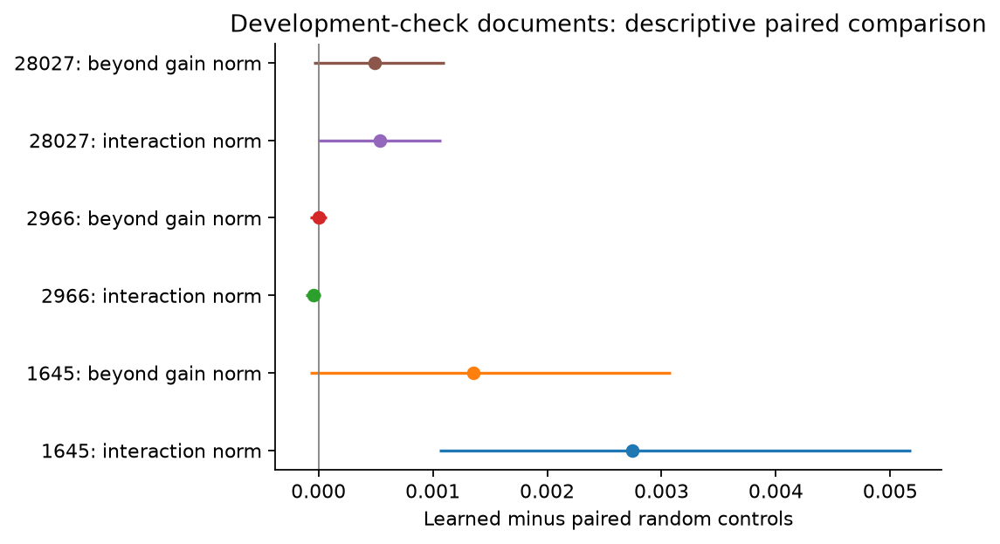
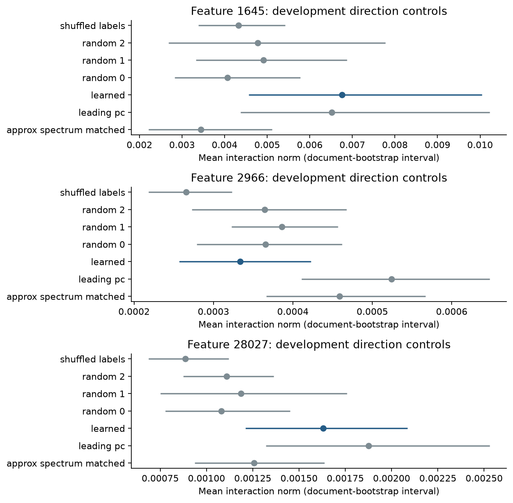
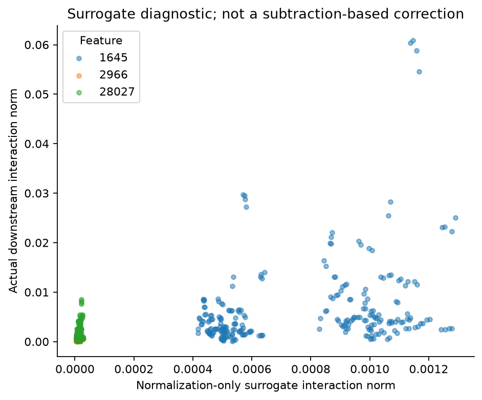
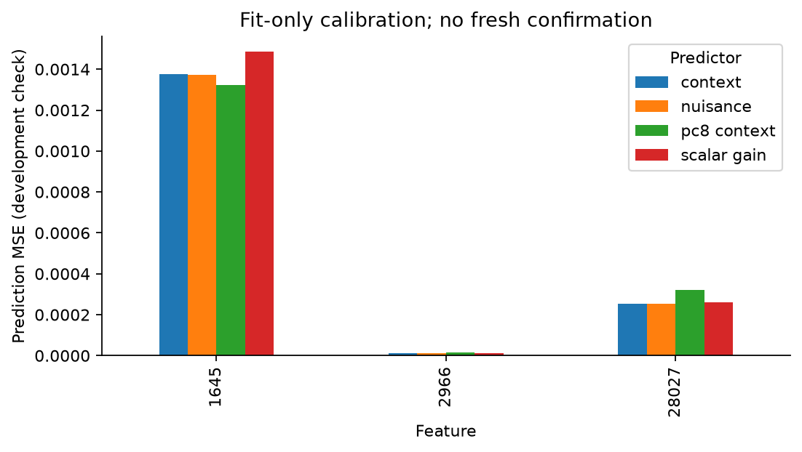
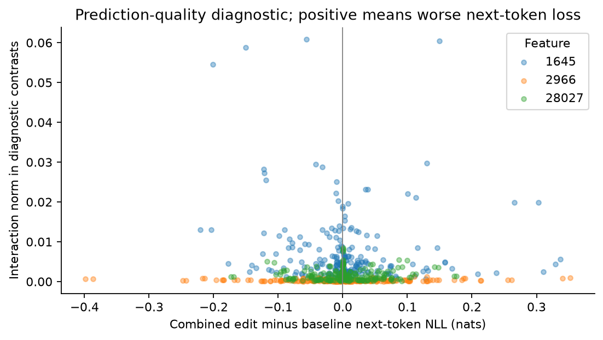

# Context intervention development pilot

Completed 96 feature-prompt cases from 95 duplicate groups, with 5376 factorial comparisons. Repeated comparisons are not independent sample units.

These are development diagnostics on previously collected documents. The readouts describe numerical and word-boundary formatting, not validated semantic behaviors. There are no confirmatory discoveries or causal claims about natural text semantics in this report.

## Research question and methods

The model is Gemma 3 4B at native block 17, using the 65,536-feature Gemma Scope 2 dictionary. Each supported feature contributes eight fit and eight check documents per source (FineWeb-Edu and English Wikipedia). A seeded duplicate-group split prevents fit/check overlap across features. Both subsets come from the old foundation corpus.

Can a direction learned from ordinary SAE activation contexts predict and selectively modify a fixed decoder intervention? The proposed contribution is a transferable causal explanation; this experiment tests its first development diagnostics.

An SAE (sparse autoencoder) represents a layer activation through a sparse set of learned dictionary entries, here called pseudo-concepts. The decoder vector u gives an intervention direction; the encoder vector w measures the focal feature score. Context perturbations delta preserve both coordinates and residual norm. Alpha sets the fixed decoder dose. Y denotes a specified output logit contrast.

The first equation compares the decoder effect with and without a context edit. The constraints in the second line hold in real arithmetic and are audited after float32 rounding. A nonzero interaction can arise from generic downstream nonlinearity; it is insufficient evidence of a special mechanism.

PCA (principal component analysis) orders orthogonal directions by activation variance. Eight foundation PCs provide a richer context baseline, while the first PC supplies a perturbation control. Ridge regression predicts intervention effects with a penalty on large coefficients. The scalar-gain model allows context to scale one training-mean effect direction, testing whether predictive value needs more than amplification.

Maximum representable-state relative constraint error: 1.4e-06.

The model runs in float32 with TF32 disabled; the original collection was bfloat16. Context directions were frozen before intervention outputs. All four cells recompute the full identical prefix. The decoder dose is fixed within a comparison; the context edit is calculated once from its baseline.

Prediction uses fixed ridge regularization and fit-only scaling/encoding. Token identity, source, encoder score, norm, position, support and trailing digit/Latin-letter counts are nuisance inputs. Models add the learned context score, eight reference PCs, or constrain prediction to scalar gain. The PC basis comes from the original foundation discovery data, not a new confirmation set. The check split is development data, and these intervals are descriptive without multiplicity correction or calibration-fit uncertainty.

Control intervals resample duplicate groups and weight documents equally. Small/zero baseline effects are excluded only from the beyond-gain projection at squared norm <=1e-8; their raw interactions remain. The spectrum-matched control is approximate after enforcing constraints. The normalization-only surrogate is a diagnostic, not a complete model of transformer normalization.

## What this pilot establishes

Features with a pooled development-check interval entirely above zero for learned-minus-random raw interaction: 1645.

Features passing the analogous beyond-gain comparison: none. Features with a pooled prediction-improvement interval entirely above zero: none.

These are descriptive interval summaries, not corrected discoveries. A small pilot cannot establish absence of an effect. Nevertheless, raw modulation alone does not meet the proposed novelty criterion: prediction, selective function beyond gain, and a validated downstream mechanism must be connected before making that claim.

The current evidence does not justify presenting the strong hypothesis as a positive result or scaling this exact design directly into confirmation. The next scientific task is to improve and validate the behavioral endpoints and determine whether the observed modulation is mostly formatting or gain. Any revised hypothesis remains exploratory until separately frozen and tested on fresh data.

## Development prediction check

Positive improvement means lower error after adding the learned context score. Intervals resample check documents with the fitted predictor held fixed.

| Feature | Calibration source | MSE improvement | 95% descriptive interval |
| --- | --- | ---: | ---: |
| 1645 | fineweb-edu-sample | -2.495e-05 | [-8.384e-05, 1.883e-05] |
| 1645 | pooled | -4.826e-06 | [-2.339e-05, 1.746e-05] |
| 1645 | wikimedia-en | -2.466e-05 | [-5.416e-05, 3.131e-06] |
| 2966 | fineweb-edu-sample | -1.23e-07 | [-4.453e-07, 1.056e-07] |
| 2966 | pooled | -6.223e-09 | [-2.82e-08, 1.474e-08] |
| 2966 | wikimedia-en | -1.606e-09 | [-1.063e-08, 8.918e-09] |
| 28027 | fineweb-edu-sample | -2.929e-06 | [-1.244e-05, 7.872e-06] |
| 28027 | pooled | 2.588e-07 | [-4.096e-06, 4.91e-06] |
| 28027 | wikimedia-en | 7.249e-06 | [-1.639e-07, 1.5e-05] |

## Candidate support

| Feature | Preparation status | Within-stratum observations |
| --- | --- | ---: |
| 1645 | ok | 1418 |
| 28027 | ok | 133 |
| 7087 | insufficient_overlap | 17 |
| 2966 | ok | 53 |

Inactive feature-prompt cases under the float32 focal encoder, despite selection from positive bfloat16 collection activations: 1. All remain reported; no outcome-dependent exclusion is applied.

Figure 1. Paired learned-minus-mean-random comparisons on development-check documents. Beyond-gain values remove the best scalar rescaling of the baseline two-contrast effect. Intervals are descriptive and uncorrected.

Figure 2. Direction controls, pooled over development cases and fixed doses. Intervals resample documents; separate overlapping intervals are not a paired comparison.

Figure 3. Actual and normalization-only interactions for learned context directions. The surrogate does not remove all normalization mechanisms in the full transformer.

Figure 4. Layerwise residual interaction norms for the learned direction and one seeded random example. Curves show where interactions develop, not which pathway causes them.

Figure 5. Prediction error on development-check documents after pooled fit-only calibration. Lower is better; scalar gain constrains the output-effect direction.

Figure 6. Interaction versus change in loss on the observed next token. Positive horizontal values indicate worse prediction. This is a local quality diagnostic.

## Remaining requirements

Review meaningful behavior contrasts; calibrate a minimally useful effect and sample size; freeze a new protocol; collect deduplicated fresh prompts; test pathway ablation/rescue and an independent SAE. Neither this pilot nor more plots can substitute for those steps.

## Relation to prior work

FEGA already characterizes context-dependent clouds of SAE intervention effects [1]. Steering side-effect prediction from feature statistics is also established [2], and the cylindrical representation hypothesis studies how normal-plane context modulates steering [3]. Component/bypass interaction and its relation to downstream curvature are prior results [4]. This pilot makes no claim of novelty from an effect plot or nonzero factorial interaction alone.

## References

[1] Hoang et al. (2026). [Sparse Autoencoders Encode Both Concepts and Functions: The Downstream Geometry of Feature Effects](https://arxiv.org/abs/2607.24645).

[2] Duan (2026). [Pre-Intervention Prediction of Sparse Autoencoder Steering Side Effects](https://arxiv.org/abs/2606.08365).

[3] Gao et al. (2026). [The Cylindrical Representation Hypothesis for Language Model Steering](https://arxiv.org/abs/2605.01844).

[4] Vaidyanathan et al. (2026). [The Curse of Multiple Mediators: Hidden Interaction Effects in Activation Patching](https://arxiv.org/abs/2606.27510).
