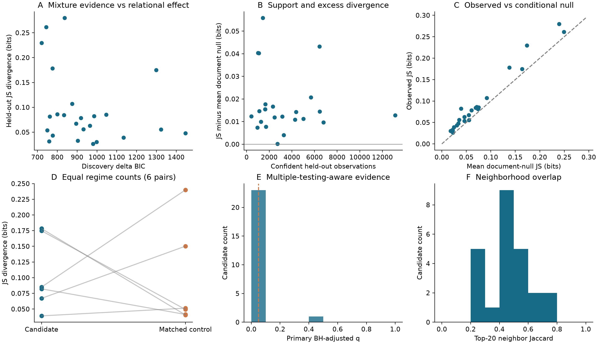
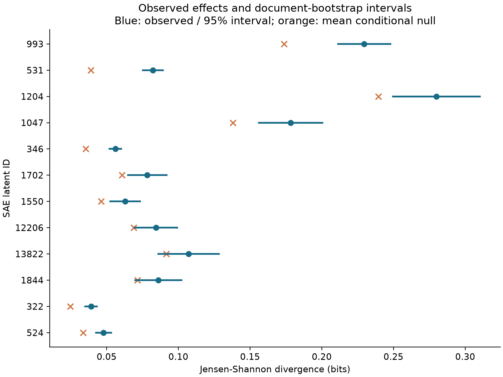
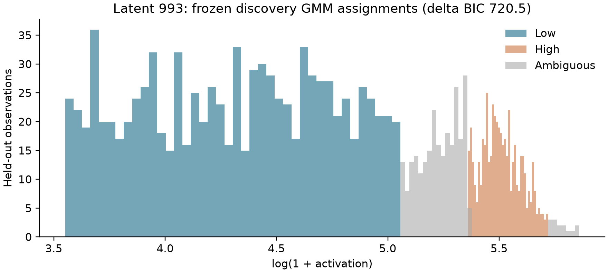
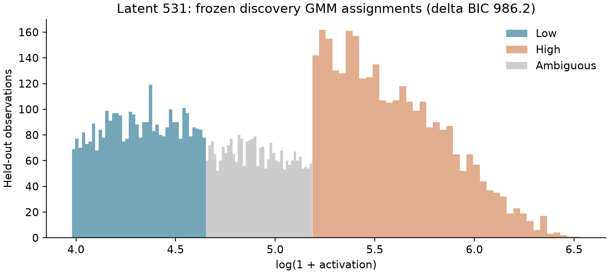
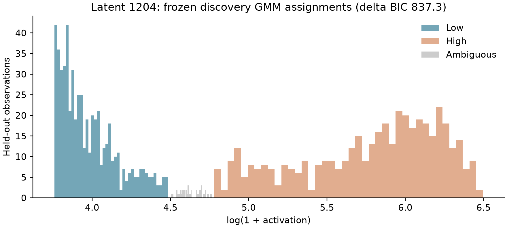

# Activation magnitude and SAE neighborhood structure

## A document-held-out pilot with Gemma 3 1B and Gemma Scope 2

Research report | gemma1b_regimes_positive | Real-model GPU experiment | Exploratory, not peer reviewed

## Abstract

We tested whether low- and high-activation observations of the same sparse-autoencoder latent have different same-token coactivation neighborhoods. We collected all positive activations from 1,000 unique documents (234,018 tokens; 181,133 eligible tokens) using google/gemma-3-1b-pt and a 16,384-latent, target-L0-60 Gemma Scope 2 SAE at native layer 13. Discovery documents determined mixture fits and candidate selection; independent evaluation documents supplied relational measurements. Of 512 screened latents, 343 met mixture qualification, 24 were selected, and 24 met held-out support criteria. Median observed Jensen-Shannon divergence was 0.0727 bits, with median excess above the conditional null of 0.0135 bits. 22 candidates passed BH and 22 passed the more conservative BY adjustment at 0.05. 6 exploratory weak-separation support-matched pairs were evaluable with identical low/high sample sizes. The median candidate-minus-control JS difference was 0.0142 bits; 3/6 candidates exceeded their controls. The median difference in null-excess JS was -0.0010 bits. These are descriptive contrasts across selected, dependent features, without an independence-based population test. We find evidence that activation regimes differ in conditional coactivation structure for 22 of 24 selected latents under the document-stratified null (BY q <= 0.05). This does not establish semantic polysemy, discrete contextual identities, or causal feature interactions.

## Research question and estimands

For a fixed latent f, let A_f(t)>0 denote its activation on an eligible token t and R_f(t) its posterior-confident low/high regime under a discovery-fitted mixture. The central estimand is P(A_j(t)>0 | A_f(t)>0, R_f(t)=r, token eligible), for each partner j. The JS statistic compares normalized vectors of these conditional probabilities. It weights partner occurrences rather than treating the partner set as a mutually exclusive categorical token label. It therefore describes relational composition, while L1 and signed conditional-mass change separately measure total membership differences.

The population is the selected, deduplicated Pile-10k document sample, truncated to the first 256 tokenizer tokens per document, with the repository's explicit clean-target policy. The inference target is the selected discovery candidates, not every SAE feature or all natural language. The GMM estimates the distribution of log(1+A) among eligible positive observations; zeros are outside that population.

## Hypotheses

The distributional screen asks whether two Gaussian components describe positive log1p activations better by BIC than one component. This is mixture-likeness, not a formal proof of two density modes. The primary relational null states that regime labels are exchangeable within document, position-bin, and positive-support-bin strata, conditional on the frozen confident observation set and stratum regime counts. Its alternative is excess JS divergence. A secondary null conditions on token identity, position, and support instead of document. Neither null makes all tokens independent or controls all contextual factors. The exploratory control question is whether mixture-qualified latents change more than weak-mixture latents of similar discovery support and document frequency.

## Experimental setup

The model was loaded at revision `fcf18a2a879aab110ca39f8bffbccd5d49d8eb29`. The SAE repository was `google/gemma-scope-2-1b-pt` at revision `b738dc06961818c011fb2e44a316352ca0f4e873`, path `resid_post/layer_13_width_16k_l0_medium`. Its native configuration identifies `model.layers.13.output`, width 16,384, JumpReLU architecture and target L0=60. We used native Hugging Face residual outputs in bfloat16 and SAE encoding in float32; all native SAE parameter tensors were checked against the pinned checkpoint. Collection ran on NVIDIA GeForce RTX 3080 Ti, PyTorch 2.12.0+cu130, CUDA 13.0. No top-k cap was applied.

Corpus: `NeelNanda/pile-10k`, revision `127bfedcd5047750df5ccf3a12979a47bfa0bafa`. A seeded permutation selected unique raw documents of at least 300 characters; raw strings were preserved, without heuristic text cleanup. Collection seed: 42. Discovery/evaluation seed: 20260907; split: 500/500 documents, with no document crossing the boundary. The repository target-token filter excludes initial position 0, empty/known mojibake strings and whitespace, special, punctuation, quote, symbol, control and mojibake target classes. Surrounding context remains available. All-positive collection passed finite-value and dimension checks. The recorded single-document reconstruction check is a compatibility diagnostic, not a corpus-wide reconstruction-quality estimate.

## Methods

### Discovery, mixtures and assignment

Latents required at least 200 eligible discovery activations in 30 documents. We uniformly sampled up to 512 of these latents using a fixed seed (5483 were eligible). One- and two-component Gaussian mixtures used log(1+A), full scalar covariance, scikit-learn default covariance regularization 1e-6, tolerance 1e-3, max_iter=100, k-means initialization and 5 starts. BIC is -2 log-likelihood + k log(n); delta BIC = BIC(1)-BIC(2). Qualification requires convergence, delta BIC >= 10.0, both component weights >= 0.1, and separation (mu_high-mu_low)/sqrt((variance_low+variance_high)/2) >= 2.0. Components are ordered by their log1p means. Highest discovery delta BIC, then latent ID, determines the cap of 24; there is no composite scientific score.

Frozen discovery parameters assign evaluation observations to low or high only when that component's posterior is >= 0.9. Others remain ambiguous and are excluded from relational tests but retained as evidence. Each regime requires 60 observations in 20 documents. Failures remain in the selected testing family with p=1. GMM diagnostics and downstream effect estimates use different documents; held-out observations never refit the GMM or rank discovery candidates.

### Neighborhoods and effect sizes

The partner universe is every SAE latent except the focal latent with at least 10 occurrences pooled across the two confident evaluation regimes. This filter is invariant to all subsequent label permutations. It is constructed directly from complete sparse activations, with no global graph cap. For partner j and regime r, c_rj is the joint count and n_r the regime size, so p_rj=c_rj/n_r. JS uses q_rj=c_rj/sum_j(c_rj), m=(q_low+q_high)/2 and JS=0.5 sum_j[q_low,j log2(q_low,j/m_j)+q_high,j log2(q_high,j/m_j)]. Its range is 0 to 1 bit; an empty distribution is undefined, never silently zero.

Other metrics are cosine between p vectors; sum_j |p_high,j-p_low,j|; signed sum_j(p_high,j-p_low,j); Jaccard of the top-20 strictly nonzero neighbor sets; and Spearman correlation of counts restricted to shared top neighbors (undefined for insufficient or constant ranks). Ties are resolved by latent ID. The exported regime-event Jaccard is c_rj/(n_r+n_j-c_rj) on the complete eligible evaluation-token universe. PMI=ln(c_rj*N/(n_r*n_j)) is emitted only if the regime pair has adequate support. These event metrics are descriptive. Raw-count zeros within the saved partner universe are observed zeros; absent partners were filtered and must not be imputed into that universe as zeros.

### Nulls, uncertainty and multiple comparisons

Each feature uses 1999 independently seeded label shuffles, preserving feature identity and exact regime counts within strata. Primary strata are document x floor(position/64) x floor(number of positive latents/16); secondary strata replace document with exact token ID. Single-regime strata remain fixed. Movable fractions quantify how much the null can randomize. Empirical p=(1+number of null JS >= observed JS)/(B+1), with resolution 0.00050. This plus-one estimator follows Phipson and Smyth [2]. Null means, 95th percentiles, all replicates, and observed-minus-null effects are saved.

BH q-values are reported for the selected candidate family, with BY q-values as a conservative arbitrary-dependence sensitivity [3]. Secondary-null adjustments form a separate, explicitly secondary family; selecting the better of the two does not constitute a corrected primary test. Approximate pointwise 95% confidence intervals are observed JS +/-1.96 document-bootstrap standard errors, clipped to [0,1], from 300 document resamples of evaluation observations. Resampling preserves within-document token clusters and fixes the GMM and partner set. Raw bootstrap percentile ranges and bootstrap bias are separately exported as diagnostics; divergence has positive finite-sample bias. Normal-approximation intervals are descriptive, may have poor coverage near boundaries, and do not account for corpus selection, GMM fitting, candidate selection or multiple-feature interval coverage.

### Matched controls and contextual review

Controls must have a converged discovery fit and delta BIC <10. Greedy nearest matching, without replacement, uses Euclidean distance in log discovery activation count and log distinct-document count, with absolute per-coordinate caliper 0.35. Frequency is redundant with support on a common eligible-token denominator. Variance is recorded for balance diagnostics, not matched. Each control's low/high tails are fixed by discovery activation quantiles matching the candidate's discovery-confident fractions; these are magnitude-based controls, not claimed mixture regimes. Evaluation control tails must contain enough observations to downsample without replacement to exactly the candidate's two regime sizes. No extra control is substituted after evaluation failure; exclusions are reported.

Context examples are selected algorithmically by cosine to their own regime's partner centroid, allowing at most one example per document per selection category. Counterexamples maximize opposite-minus-own centroid similarity and are structural challenges, not validated semantic contradictions. Ambiguous examples have posterior nearest 0.5. Raw text, contiguous tokenizer-decoded spans, target ID/string, position, activation, both posteriors and up to 20 coactivating features accompany each example. Contexts include a right-hand window for reading; future tokens are not causal inputs to the target activation. A randomized blind annotation sheet and separate key support subsequent human review. No annotation has yet been completed and no automatic semantic label is treated as ground truth.

## Results

| feature_id | n_low | n_high | js_bits | null_excess | document_q_bh | document_q_by | neighbor_jaccard |
| --- | --- | --- | --- | --- | --- | --- | --- |
| 993 | 939 | 496 | 0.2296 | 0.05586 | 0.0005455 | 0.00206 | 0.3333 |
| 531 | 3438 | 3009 | 0.08219 | 0.04316 | 0.0005455 | 0.00206 | 0.5385 |
| 1204 | 575 | 432 | 0.28 | 0.04039 | 0.0005455 | 0.00206 | 0.2903 |
| 1047 | 219 | 869 | 0.1783 | 0.04022 | 0.0005455 | 0.00206 | 0.2903 |
| 346 | 2753 | 2938 | 0.05605 | 0.0207 | 0.0005455 | 0.00206 | 0.4815 |
| 1702 | 1093 | 555 | 0.07834 | 0.01767 | 0.0005455 | 0.00206 | 0.2903 |
| 1550 | 1519 | 798 | 0.06287 | 0.01665 | 0.0005455 | 0.00206 | 0.4286 |
| 12206 | 1104 | 540 | 0.0844 | 0.01549 | 0.0005455 | 0.00206 | 0.4815 |
| 13822 | 1258 | 381 | 0.1071 | 0.01542 | 0.0005455 | 0.00206 | 0.5385 |
| 1844 | 637 | 480 | 0.0861 | 0.01468 | 0.0005455 | 0.00206 | 0.4286 |
| 322 | 3433 | 3016 | 0.03911 | 0.01449 | 0.0005455 | 0.00206 | 0.4286 |
| 524 | 2981 | 1398 | 0.04781 | 0.01428 | 0.0005455 | 0.00206 | 0.6667 |
| 4006 | 4711 | 8421 | 0.03045 | 0.01275 | 0.0005455 | 0.00206 | 0.7391 |
| 12323 | 84 | 328 | 0.2614 | 0.01232 | 0.06313 | 0.2384 | 0.2121 |
| 292 | 1997 | 1149 | 0.04315 | 0.01226 | 0.0005455 | 0.00206 | 0.4815 |
| 718 | 1555 | 919 | 0.06705 | 0.01186 | 0.0005455 | 0.00206 | 0.4815 |
| 380 | 2876 | 2134 | 0.03279 | 0.01121 | 0.0005455 | 0.00206 | 0.7391 |
| 485 | 3240 | 1030 | 0.1748 | 0.0109 | 0.0005455 | 0.00206 | 0.2121 |
| 7603 | 921 | 352 | 0.08501 | 0.009961 | 0.0005455 | 0.00206 | 0.6667 |
| 10313 | 3537 | 3260 | 0.03172 | 0.009688 | 0.0005455 | 0.00206 | 0.5385 |
| 1731 | 1145 | 573 | 0.05376 | 0.007703 | 0.0005455 | 0.00206 | 0.6 |
| 3234 | 694 | 256 | 0.08125 | 0.00738 | 0.0005455 | 0.00206 | 0.4286 |
| 1036 | 2047 | 1224 | 0.02645 | 0.004049 | 0.0005455 | 0.00206 | 0.6 |
| 1120 | 1576 | 1148 | 0.05561 | 0.0001559 | 0.424 | 1 | 0.4815 |

Figure 1 shows mixture evidence, support, the conditional null, matched controls, adjusted evidence and neighbor overlap. These plots describe the selected candidate family.

## Aggregate analysis

We find evidence that activation regimes differ in conditional coactivation structure for 22 of 24 selected latents under the document-stratified null (BY q <= 0.05). Median JS among supported candidates was 0.0727 bits and median null excess was 0.0135 bits. Under the secondary token-identity-stratified null, 19 selected candidates passed BY q <= 0.05. These counts cannot establish how prevalent the phenomenon is across the full SAE dictionary: candidates were selected for strong discovery mixture evidence and evaluation eligibility varies by feature. The top-24 cap and initial supported-feature sampling further delimit the population. There is no justified single population-level semantic conclusion.

## Controls and nulls

6 exploratory weak-separation support-matched pairs were evaluable with identical low/high sample sizes. The median candidate-minus-control JS difference was 0.0142 bits; 3/6 candidates exceeded their controls. The median difference in null-excess JS was -0.0010 bits. These are descriptive contrasts across selected, dependent features, without an independence-based population test. Discovery matching succeeded for 0 of 24 selected candidates; remaining matches were explicitly unavailable within the caliper. A failure to obtain controls weakens the specificity claim, even when within-feature permutation evidence is strong.

| candidate_id | control_id | candidate_js | control_js | paired_js_difference |
| --- | --- | --- | --- | --- |
| 485 | 347 | 0.1748 | 0.04928 | 0.1255 |
| 322 | 68 | 0.03911 | 0.0514 | -0.01229 |
| 7603 | 2897 | 0.08501 | 0.24 | -0.155 |
| 531 | 66 | 0.08219 | 0.0414 | 0.04079 |
| 718 | 396 | 0.06705 | 0.1503 | -0.08321 |
| 1047 | 6068 | 0.1783 | 0.04052 | 0.1378 |

## Candidate-level analysis

The following cases are ordered lexicographically by primary BY q, then null-excess JS, then feature ID. This is a transparent review order, not a calibrated scientific score. Text examples are preselected by the algorithm described above and have not been semantically adjudicated.

### Latent 993

Observed JS=0.2296 bits, null excess=0.0559; primary p=0.0005, BY q=0.00206. Regime supports: 939/496 observations across 325/241 documents. Assignment rate=84.5%; primary movable fraction=17.3%.

**Low / centroid_representative**, document 614, token 16, activation 117.038, P(low)=1.000, P(high)=0.000; target `2`.

> <bosHello, Mr. Perez On Mon, Mar 16, 2009 at 5:42 AM, Fernando Perez <fperez.net@gmail

**Low / centroid_representative**, document 678, token 175, activation 128.665, P(low)=0.999, P(high)=0.001; target `2`.

>  (FLoC'02) will be held in Copenhagen, Denmark, in July 2002, jointly hosted jointly by the IT University of Copenhagen, the Technical University of Denmark

**High / centroid_representative**, document 919, token 79, activation 262.829, P(low)=0.053, P(high)=0.947; target `2`.

>  Project Syndicate, Eric Schmidt, the Executive Chairman of Google, reveals that JLo and her infamous 2000 Grammys Versace dress are the reason we can type a name into the search bar and

**High / centroid_representative**, document 26, token 89, activation 284.714, P(low)=0.068, P(high)=0.932; target `2`.

>  with a helpful reminder of my flight number and departure time and the other with a link to the 2D barcode you see above.  You should have seen the look of abject terror on the counter

**Ambiguous / ambiguous**, document 569, token 36, activation 175.971, P(low)=0.498, P(high)=0.502; target `2`.

>  molecular forms on human T and B lymphoblastoid cell lines. The monoclonal antibody 4F2 recognizes a disulfide-linked ricin-binding glycoprotein complex (Mr congruent to 125,

**Ambiguous / ambiguous**, document 237, token 77, activation 175.767, P(low)=0.503, P(high)=0.497; target ` two`.

> ans. To gain insight into the mechanisms of fungus pathogenesis and plant responses, leaves of a resistant and two susceptible Prunus persica genotypes were inoculated with blastospores (yeast), and the infection was

**Structural counterexample (low)**, document 684, token 101:

>  sources for adolescents and the elderly are included. The proportion of children 'fully vaccinated' at 12, 24 and 60 months of age was 91.6%, 9

### Latent 531

Observed JS=0.0822 bits, null excess=0.0432; primary p=0.0005, BY q=0.00206. Regime supports: 3438/3009 observations across 347/159 documents. Assignment rate=71.3%; primary movable fraction=55.4%.

**Low / centroid_representative**, document 304, token 173, activation 96.648, P(low)=0.937, P(high)=0.063; target ` population`.

>  research collaboration to identify and characterize clinical predictors and candidate genetic modifiers in a large, unique LQTS founder population in South Africa (SA-LQTS). We have hypothesized the existence of two types of modifier genes

**Low / centroid_representative**, document 107, token 241, activation 66.467, P(low)=0.994, P(high)=0.006; target `otoxicity`.

>  in haemocytes. Several characteristics suggest that haemolymph is the more appropriate test tissue for environmental genotoxicity assessment: (1) a shorter preparation time of slides, (2

**High / centroid_representative**, document 904, token 24, activation 366.328, P(low)=0.000, P(high)=1.000; target `otide`.

> term project objective is the commercialization of a safe, effective, easy to use, and painless polynucleotide vaccine delivery system that can be used in polynucleotide vaccines for biodefense against NIAID Category A

**High / centroid_representative**, document 632, token 24, activation 534.789, P(low)=0.000, P(high)=1.000; target `coma`.

>  a 9.5-kbp fragment of an oncogene present in a human fibrosarcoma cell line (HT-1080). The cloned fragment is present in all tested HT-

**Ambiguous / ambiguous**, document 176, token 136, activation 137.929, P(low)=0.500, P(high)=0.500; target ` strength`.

>  structural components in design. For these applications the elastomeric sealant or adhesive must not only have high tensile strength but should achieve such strength in a matter of a few hours so that the automobile may be safely driven

**Ambiguous / ambiguous**, document 923, token 28, activation 137.938, P(low)=0.500, P(high)=0.500; target ` tennis`.

> ialian (; born 4 July 1963) is a female Chinese-born table tennis player who now represents Luxembourg. She was born in Shanghai, and resides in Ettelbruck.

**Structural counterexample (low)**, document 924, token 3:

> <bos>[Early parenteral nutrition in complex post-operative periods]. The protein hypercatabolic state in critically ill pediatric patients

### Latent 1204

Observed JS=0.2800 bits, null excess=0.0404; primary p=0.0005, BY q=0.00206. Regime supports: 575/432 observations across 281/170 documents. Assignment rate=95.9%; primary movable fraction=12.6%.

**Low / centroid_representative**, document 494, token 36, activation 45.476, P(low)=1.000, P(high)=0.000; target ` Yards`.

> .2008  Friday night is date night. Friday night is also student night at Camden Yards... a.k.a. Baltimore Orioles ball park a.k.a. Ben's

**Low / centroid_representative**, document 479, token 19, activation 42.185, P(low)=1.000, P(high)=0.000; target ` chat`.

> <bosQ:  bootstrap.min.css sets transparency where not wanted  I have a small chatbox at the bottom of my page which seems to be inheriting CSS style from bootstrap.min.css

**High / centroid_representative**, document 684, token 54, activation 513.203, P(low)=0.000, P(high)=1.000; target ` at`.

>  range of standard measures derived from Australian Childhood Immunisation Register (ACIR) data. These include coverage at standard age milestones and for individual vaccines included on the National Immunisation Program (NIP). For the

**High / centroid_representative**, document 16, token 12, activation 407.099, P(low)=0.000, P(high)=1.000; target ` at`.

> <bos‘Rock’n’Roll Bangkok’ to be witnessed at The Overstay in Pinklao. Featuring five bands of original and authentic R’n’R

**Ambiguous / ambiguous**, document 327, token 37, activation 101.997, P(low)=0.539, P(high)=0.461; target ` acute`.

>  following treatment of malignancy diseases has been long established. Cancer therapeutics-related cardiac dysfunction (CTRCD), acute arrhythmias, pericardial disease, valvopathies and early atherosclerotic Cardiovascular Disease (CVD), are the

**Ambiguous / ambiguous**, document 600, token 180, activation 101.568, P(low)=0.555, P(high)=0.445; target ` at`.

>  something or is width not actually provided within the OSM.  A:  Well, if you look at the OSM tags in use, you will discover the width=* tag, that can be used for highways

**Structural counterexample (low)**, document 675, token 161:

>  Dr. Carson gave an interview to Newsmax TV to discuss his recent endorsement of Mr. Trump. During the interview, Dr. Carson stated that he believed Mr. Trump would “surround himself with very

## Dependence sensitivity

A sensitivity analysis retained one uniformly sampled confident observation per document and feature, without consulting the regime or partner values during sampling. 20/24 features retained minimum regime support; 5/24 passed BY q <=0.05 under the token-identity/position/support null, counting support failures as p=1. This reduces within-document pseudoreplication but remains conditional on cross-document exchangeability and coarse support matching. It is an exploratory sensitivity, not independent replication.

## Exploratory control amendment

The strict delta-BIC<10 control arm is preserved in regime_matched_controls.parquet. It produced no support-matched controls in the initial run. After this failure, we added an explicitly exploratory arm: up to 2,048 additional discovery-supported latents were sampled using seed+1, fitted only on discovery documents, and pooled with the original screen. Controls in this arm require convergence and standardized component separation below 2. The original support/document calipers and exact evaluation regime-size requirement remain unchanged. Fits, matches and null replicates are exported separately with the weak_control prefix. Weak separation does not imply a one-Gaussian distribution, so this amendment tests specificity relative to weakly separated mixtures only. It must not be described as a successful strict-BIC control analysis. This is a post-hoc exploratory amendment and needs prospective replication.

## Interpretation

Activation-conditioned relational change is compatible with several explanations: continuous contextual specificity, lexical identity, changing activation support, topic variation, or multiple contextual uses. A mixture fit does not distinguish these explanations. Even a candidate that exceeds its random-split null can behave like ordinary weak-mixture controls. Semantically distinct regimes require blinded annotations with reliability checks and replication, and causal claims require interventions. The strongest current conclusion is restricted to empirical conditional coactivation structure under the stated exchangeability assumptions.

## Threats to validity and skeptical review

1. **Magnitude alone.** Regime membership is itself a function of activation magnitude. Null rejection detects association, not a discontinuity or a special two-state mechanism. Quantile-tail controls are essential; a smooth activation-to-context relationship remains a viable explanation.
2. **Top-k censoring.** The primary collection stores all positive activations, removing rank competition from this estimand. The historical 100-document top-32 artifacts lack current lineage and were not reused as scientific evidence. Generalization to rank-censored collections is untested.
3. **Corpus dependence.** Pile-10k is a small, preselected corpus sample. Deduplication here removes exact repeated raw texts only; near duplicates and shared sources can still correlate documents. First-window truncation favors document openings.
4. **Tokenization and support.** Target filtering changes the population. Subwords, lexical identity and position remain plausible drivers. The secondary lexical null and primary document null control different confounders, not all simultaneously. Positive-support bins are coarse, so within-bin magnitude/support confounding can remain.
5. **Exchangeability.** Shuffling within document/position/support does not guarantee exchangeability of naturally ordered tokens. Adjacent tokens can remain dependent. The cluster bootstrap improves uncertainty treatment but cannot validate the permutation null. Very low movable fractions indicate conditional tests with little power. Therefore p/q values are conditional-model evidence, not assumption-free proof.
6. **Missing edges.** The raw membership matrix avoids confusing graph truncation with zero. The pooled support threshold still changes the analyzed partner population; instability below the threshold is not estimated. Different candidates can have different partner sets.
7. **GMM misspecification.** A skewed or heavy-tailed unimodal distribution may favor two Gaussians. Separation and weight screens do not certify density bimodality. Parameters are on log1p scale, not log scale, and are conditional on positivity. GMM selection uncertainty is not included in the reported CIs.
8. **Multiple comparisons and selection.** Held-out evaluation separates fitting from testing; BH and BY include selected support failures. Feature tests share tokens and partners. BY handles arbitrary dependence only when each p-value is valid under its null; it cannot repair exchangeability violations. Candidate rankings remain exploratory and interval coverage is pointwise.
9. **Controls.** Matching is on support and document frequency, not every activation-distribution property. Control failures and discovery calipers limit comparability. A raw divergence difference is not a causal treatment effect of mixture-likeness.
10. **SAE/model specificity.** One pretrained model, one layer, width and target L0 were tested. No SAE-seed, layer, model or corpus replication is claimed. Decoder geometry and historical PCA/UMAP are descriptive and were not used as semantic validation.
11. **Context interpretation.** Representative and contrary contexts were chosen computationally. Human readers may nevertheless invent post-hoc themes. Blinded independent annotation, negative examples and a held-out semantic validation set remain necessary. Coactivation is descriptive and is not causal interaction.

## Scientific conclusion

We find evidence that activation regimes differ in conditional coactivation structure for 22 of 24 selected latents under the document-stratified null (BY q <= 0.05). 6 exploratory weak-separation support-matched pairs were evaluable with identical low/high sample sizes. The median candidate-minus-control JS difference was 0.0142 bits; 3/6 candidates exceeded their controls. The median difference in null-excess JS was -0.0010 bits. These are descriptive contrasts across selected, dependent features, without an independence-based population test. These results support continued investigation of activation-conditioned relational structure. They do not establish that SAE latents lack a single semantic identity, or that distinct semantic concepts occupy the fitted components.

## Next experiments

Use the Colab larger configuration for more documents and a wider discovery screen, preserving the discovery/evaluation boundary. Replicate on a distinct corpus and later document windows. Compare against flexible smooth activation-response models to distinguish continuous specificity from discrete regimes. Repeat with target L0 variants, widths, layers and model sizes. Obtain two blinded annotators per context, define categories without exposing activation regime, measure inter-rater agreement, then test regime/category association on a new semantic holdout. Finally, use activation patching or carefully designed interventions to test causal consequences. Larger compute alone does not resolve these identification problems.

## Reproducibility and artifacts

The machine-readable experiment manifest records Git SHA and dirty state, code hashes, exact model/SAE/corpus revisions, checkpoint checksum, runtime versions, all filtering policies, seeds, GMM settings, confidence/support thresholds, null counts and control parameters. Per-25-document collection chunks and per-feature analysis checkpoints preserve completed work. Legacy lineage is untouched; this fresh run has its own collection/analysis lineage. Source texts and raw positive sparse activations are retained for independent analysis. Full posterior assignments, fits, regime edges, null replicates, controls, context examples and CSV tables accompany this report. The final bundle includes the source used to generate the experiment so uncommitted code is not lost.

## References

[1] Google DeepMind. Gemma Scope 2 technical report and model release. [Official model card](https://huggingface.co/google/gemma-scope-2-1b-pt) and [technical report](https://storage.googleapis.com/deepmind-media/DeepMind.com/Blog/gemma-scope-2-helping-the-ai-safety-community-deepen-understanding-of-complex-language-model-behavior/Gemma_Scope_2_Technical_Paper.pdf).

[2] Phipson, B. and Smyth, G. K. (2010). Permutation p-values should never be zero: calculating exact p-values when permutations are randomly drawn. [Author manuscript](https://gksmyth.github.io/pubs/PermPValuesPreprint.pdf).

[3] Benjamini, Y. and Yekutieli, D. (2001). The control of the false discovery rate in multiple testing under dependency. Annals of Statistics 29(4), 1165-1188. [Author manuscript](https://www.math.tau.ac.il/~ybenja/depApr27.pdf).
