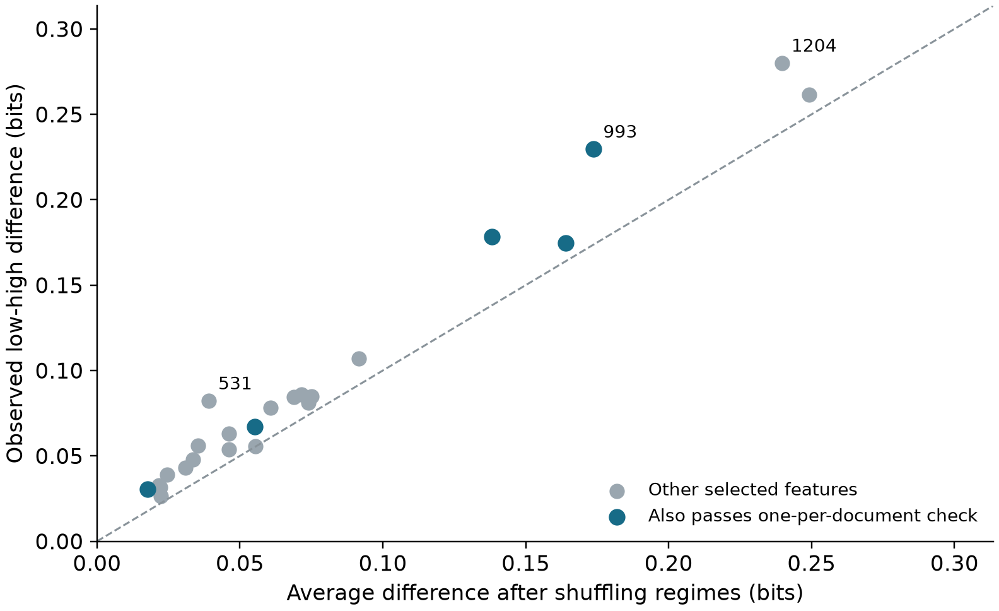
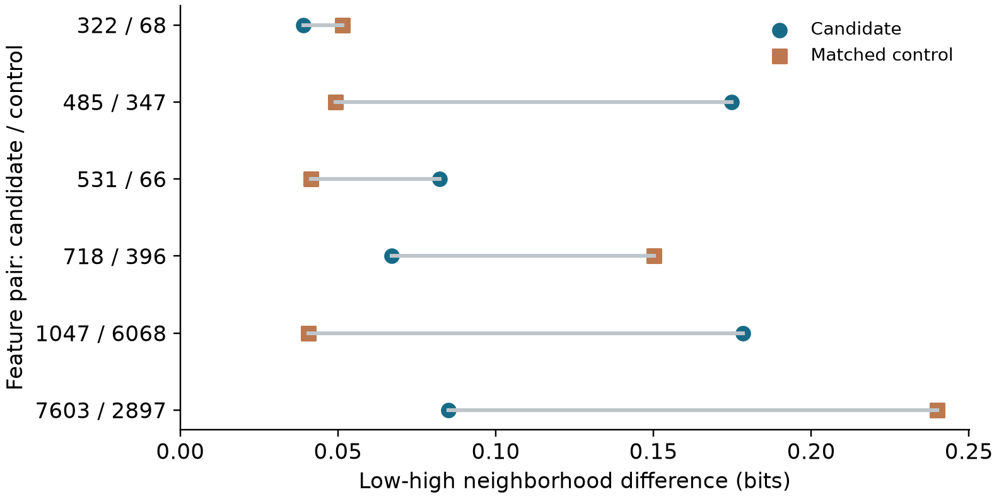

# Do SAE features change with activation strength?

## Summary

This experiment asks whether an SAE feature has the same coactivation pattern when it activates weakly and when it activates strongly. In a sample of 1,000 documents, 22 of 24 selected features showed a larger neighborhood difference than expected under a constrained random split. With one observation per document, 5 of the 24 selected features passed the sensitivity check. Only 3 of the 6 evaluable matched pairs favoured the candidate over its control.

The evidence supports activation-dependent coactivation structure in some features. It does not yet show that these features represent different semantic concepts at different activation strengths, or that the effect is specific to features with a mixture-like activation distribution.

## 1. Motivation

An SAE feature is often interpreted through the passages where it activates most strongly. Those examples can suggest a useful description, but they leave a question open: does that description also apply when the same feature activates more weakly?

A stronger activation might indicate a clearer instance of the same pattern. It might instead occur in a different kind of context. These possibilities matter because a single global description can hide variation across the feature's activation range.

The first step here is relational rather than semantic. For each feature, I compare the other SAE features active on the same token at low and high activation strengths. If these neighborhoods differ, there is a reason to inspect the contexts more closely. A neighborhood difference alone, however, does not tell us what the feature means.

## 2. What is being compared?

An SAE represents a model activation using a relatively small set of active latent features. Each feature has both an activation magnitude and a decoder direction. The decoder direction is fixed; the set of features active alongside it can change from token to token.

For a focal feature, its coactivation neighborhood describes how often each partner feature is active on the same token. The comparison uses the same focal feature in both groups. It therefore asks whether the feature's empirical surroundings change across its activation range, rather than comparing unrelated features or decoder directions.

The main measure is Jensen-Shannon divergence. It compares the composition of the two partner distributions: zero means identical normalized distributions, while larger values mean greater difference, up to one bit. Normalization removes the overall scale of partner counts. Separate conditional-probability and neighborhood-overlap measurements retain complementary information about support and shared partners.

## 3. Experimental setup

| Setting | Value |
| --- | --- |
| Language model | Gemma 3 1B, pretrained |
| SAE | Gemma Scope 2, residual stream, layer 13 |
| Dictionary width / target sparsity | 16,384 features / L0 of 60 |
| Corpus | Pile-10k |
| Documents | 500 for discovery; 500 for evaluation |
| Collected / eligible tokens | 234,018 / 181,133 |
| Context length | Up to 256 tokens per document |
| Activation collection | All positive activations; no top-k cap |

Documents were sampled with a fixed random seed and exact duplicates were removed. Initial, whitespace, punctuation and other excluded target-token classes were filtered before analysis. The results therefore describe the eligible tokens in these document openings, not the whole corpus or all possible contexts.

Storing all positive activations matters for this question. With top-k storage, a feature can disappear from the saved data simply because other features outrank it. That would make a change in recorded neighbors harder to distinguish from a storage effect.

## 4. Method

### Finding activation regimes

The discovery documents were used to fit one- and two-component Gaussian mixtures to log(1 + activation). A candidate needed a converged fit, a BIC improvement of at least 10, substantial weight in both components, and sufficiently separated component means. The fitted parameters were then frozen.

The evaluation documents played no part in fitting or selecting the candidates. An evaluation observation entered the low or high regime only when the corresponding component posterior was at least 90%. Ambiguous observations were kept for inspection but excluded from the neighborhood comparison. Each regime needed at least 60 observations across 20 documents.

A two-component fit is a way to define a useful comparison, not a semantic result. Two Gaussians may approximate a skewed continuous distribution without identifying two separate concepts, or even two density peaks.

### Comparing against a random split

Some neighborhood difference is expected whenever a finite sample is divided into two groups. To estimate that baseline, the low/high labels were shuffled 1,999 times while retaining the feature identity and the number of observations assigned to each regime within each stratum.

The main shuffle was restricted by document, token-position band and total number of positive SAE features. It therefore preserved several obvious sources of variation. The observed divergence was compared with this null distribution, and significance was assessed at a 5% Benjamini-Yekutieli adjusted threshold across all 24 selected candidates. This correction accommodates dependence between feature tests, provided the individual permutation tests are valid.

The remaining assumption is important: tokens within a stratum must be exchangeable under the null. Nearby tokens can violate that assumption. A further sensitivity analysis consequently retained only one randomly selected confident observation per document and feature, then used a token-identity, position and support-conditioned shuffle. This changes both the amount of data and the conditioning scheme; it is not a direct replication of the first test.

## 5. Results

### Mixture-like activation distributions are common

Of the 512 screened features, 343 passed the mixture qualification rules. The 24 highest-ranked candidates by discovery BIC improvement were selected for evaluation; 24 had sufficient evaluation support.

The screen is therefore not identifying a rare phenomenon in this sample. Its prevalence also makes it important to separate a statistical description of activation magnitude from evidence for a distinctive contextual mechanism.

### Neighborhoods differ, but the baseline explains part of the difference

| Measurement | Result |
| --- | --- |
| Selected candidates | 24 |
| Pass the main corrected test | 22 / 24 |
| Median low-high divergence | 0.073 bits |
| Median excess above the shuffled baseline | 0.014 bits |
| Median top-20 neighbor overlap (Jaccard) | 0.481 |

The median observed difference was 0.073 bits, whereas the median excess above the shuffled baseline was 0.014 bits. These summarize two different quantities: the first describes the total separation, and the second asks how much is left beyond the constrained random split. The latter is the more relevant number when assessing whether the effect exceeds sampling and the structure preserved by the null.

**Figure 1.** Each point is one selected feature. Points above the diagonal have greater observed divergence than their average shuffled baseline. Blue points also pass the one-observation-per-document sensitivity analysis. The diagonal compares effect sizes; it is not a significance boundary.

### The dependence check gives a narrower result

With one observation per document, 5 of the 24 selected features passed the sensitivity check. Of the 24 selected features, 20 still had sufficient regime support after retaining one observation per document. Features without enough support were counted as non-rejections in the correction, rather than removed from the testing family.

The smaller number of passing features should not be read as proof that the other effects are absent. The sensitivity analysis has fewer observations and a different null. It does show that the broad result from the first test is not equally secure for every feature. The features that pass both checks are the stronger starting points for further work.

### Mixture-qualified features do not consistently exceed controls

The original control design looked for features with weak evidence for a two-component fit and similar activation and document counts. It produced 0 matches within the prescribed caliper. That limits the conclusions that can be drawn about whether mixture-like features behave differently from weak-mixture features.

A separate exploratory comparison was added after this difficulty became apparent. It used features with less-separated mixture components, matched on discovery support and document frequency. Evaluation groups were required to have exactly the same low/high sample sizes as their candidates. These are weaker controls than the original design intended: their activation distributions can still be strongly non-Gaussian.

Only 3 of the 6 evaluable matched pairs favoured the candidate over its control. The small matched sample does not establish equivalence, but it provides no consistent evidence that the selected candidates have a special advantage in neighborhood separation.

**Figure 2.** Candidate and control divergence for each evaluable pair, using equal regime sample sizes. A candidate point further right indicates greater divergence. The direction varies across pairs.

## 6. What do individual features tell us?

The following cases illustrate why the raw neighborhood difference and the robustness of the evidence need to be considered together. They are selected examples, not a separate population estimate.

| Feature | Difference (bits) | Excess over null (bits) | One-per-document check |
| --- | --- | --- | --- |
| 993 | 0.230 | 0.056 | Passes |
| 531 | 0.082 | 0.043 | Does not pass |
| 1204 | 0.280 | 0.040 | Does not pass |

Feature 993 combines a relatively large neighborhood difference with evidence that remains under the one-per-document check. It is therefore a stronger candidate for further contextual analysis.

Features 531 and 1204 illustrate the limitation of selecting cases by effect size alone. Both show clear separation under the main analysis, but neither passes the dependence sensitivity. Feature 1204 even has a larger raw divergence than feature 993. That does not make its interpretation more secure.

The saved context examples include representative, ambiguous and contrary cases from multiple documents. They have not yet been assessed through a blinded semantic annotation study. Giving these features semantic names now would go beyond the evidence: changing coactivating partners can reflect lexical identity, topic, local syntax or degree of contextual specificity.

## 7. Interpretation and limitations

The useful result is that activation magnitude can carry information about a feature's relational context. A global summary based only on high-activation examples may therefore leave out part of its empirical behaviour. This is a reason to inspect activation ranges separately when building feature descriptions.

Several explanations remain open. A feature could represent the same pattern more specifically at higher activation, follow a smooth contextual gradient, or participate in genuinely different uses. The present comparison cannot distinguish those possibilities. In particular, the control results do not support attributing the effect specifically to a two-regime mechanism.

The experiment also has a limited scope. It uses one model, one layer, one SAE configuration and document openings from a single sampled corpus. Exact deduplication does not remove near duplicates or dependence between sources. Support thresholds favour features that activate often enough to analyse. The permutation tests depend on exchangeability assumptions, and the one-per-document analysis trades some statistical power for a different treatment of dependence. None of these measurements establishes a causal interaction between features.

## 8. Conclusion and next steps

The experiment provides evidence that some SAE features have activation-dependent coactivation neighborhoods. The strongest conclusion is about relational structure. A claim about distinct semantic identities would require additional evidence.

The next priority is to repeat the comparison on an independent corpus and test whether a smooth relationship with activation magnitude explains the observations as well as a two-regime description. The features that pass the dependence sensitivity are natural starting points for blinded context annotation, with independent annotators and a new evaluation set. Replication across layers, SAE widths and sparsity levels would then establish whether the pattern extends beyond this particular configuration.

The detailed methods, complete feature tables and reproducibility records accompany this report separately.

## References

Google DeepMind. *Gemma Scope 2*: sparse autoencoders for the Gemma 3 family. [Model release and technical report](https://huggingface.co/google/gemma-scope-2-1b-pt).

Phipson, B. and Smyth, G. K. (2010). *Permutation p-values should never be zero*. [Author manuscript](https://gksmyth.github.io/pubs/PermPValuesPreprint.pdf).

Benjamini, Y. and Yekutieli, D. (2001). *The control of the false discovery rate in multiple testing under dependency*. [Author manuscript](https://www.math.tau.ac.il/~ybenja/depApr27.pdf).
