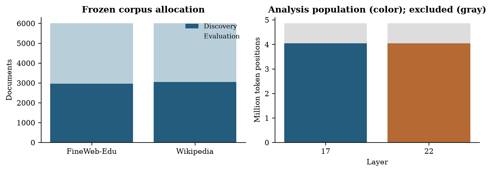
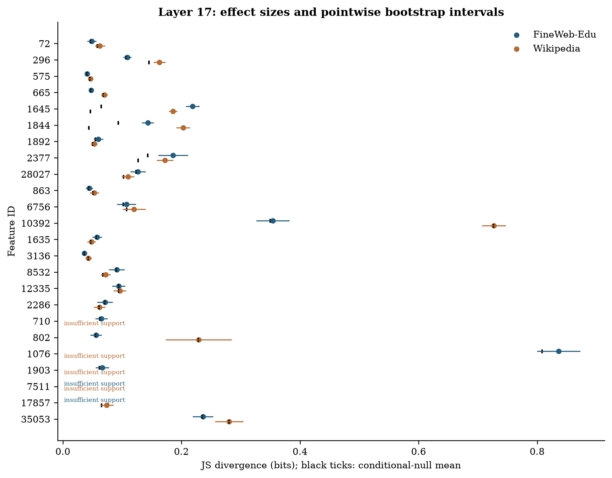
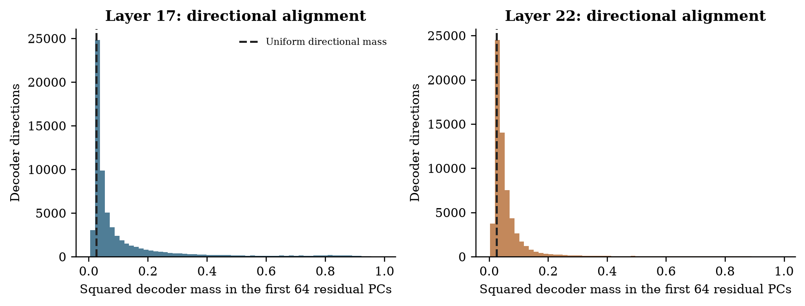

# Beyond a decoder direction?

## Activation-conditioned geometry of SAE pseudo-concepts

Research-group report | Gemma 3 4B | FineWeb-Edu and English Wikipedia

## Abstract

A sparse autoencoder (SAE) describes a language-model activation using a small number of entries from an overcomplete dictionary. Each entry has a fixed decoder direction and a variable activation strength. We ask whether strength merely scales the feature's contribution or also marks a reproducible change in its surrounding representational context. We collected all positive SAE activations for 12,000 documents at two residual-stream layers of pretrained Gemma 3 4B. Discovery-only mixture fits selected 24 pseudo-concepts per layer; held-out comparisons used one occurrence per detected duplicate group and conditional permutations within lexical, position and sparsity strata. A separate native-space test removes displacement along the focal decoder direction. At the primary layer, 14 of 24 selected pseudo-concepts passed the two-source partner-composition test and 3 passed the separate orthogonal-geometry test; 3 passed both families. These observations support activation-conditioned contextual organization for a subset of the selected pseudo-concepts. Their native displacement cannot be reduced to scaling the focal decoder vector, conditional on the covariates tested. Dictionary-wide participation, principal-component alignment and held-out reconstruction provide the geometric foundation. The findings concern conditional associations, not distinct semantic identities or causal effects on generated text.

## 1. Research question

The central hypothesis is that activation strength can index how a pseudo-concept participates in the surrounding representation. A fixed decoder vector specifies its additive contribution, but may not fully describe the contexts in which that contribution occurs. We ask whether stronger activation accompanies a different combination of other directions, reproducibly across sources and beyond lexical identity, position and total SAE support.

We use **pseudo-concept** for an SAE dictionary entry. It is a learned analytical unit, not an established atomic or canonical semantic object. Feature support, intensity distributions, cooccurrence, decoder similarity and component participation provide complementary measurements. The research question connects them to a controlled comparison between amplitude alone and contextual displacement.

Figure 1. The scientific distinction. Amplitude alone moves a contribution along its fixed decoder direction. The contextual hypothesis concerns displacement in the orthogonal complement. These synthetic points illustrate the hypothesis and are not experimental evidence.

## 2. Related work and intended contribution

Toy Models of Superposition [1] motivates studying more features than dimensions. Early SAE work [2,3] demonstrates the usefulness of sparse dictionaries for interpretation, while scaling and evaluation work [4] emphasizes reconstruction and feature quality. Gemma Scope [5] and Gemma Scope 2 [6] make broad empirical dictionary studies practical.

The Geometry of Concepts [7] is close prior work on geometric structure and cooccurrence. Decoder neighborhoods or PCA plots alone are therefore not the distinctive contribution sought here. Sparse Autoencoders Do Not Find Canonical Units of Analysis [8] motivates caution about treating dictionary entries as uniquely correct concepts. The Cylindrical Representation Hypothesis [9] studies axis-normal context in steering; our observational orthogonal test is related, but contains no steering intervention.

Our intended contribution is narrower: controlled cross-source characterization of activation-conditioned context, measured in both partner distributions and native residual geometry. We do not claim priority for context-dependent representation or a new geometric theory. A successful result makes an amplitude-only description incomplete for particular observations; it does not show that a decoder direction rotates.

## 3. Experimental material and observation units

We use the native text backbone of pretrained Gemma 3 4B [10], with Gemma Scope 2 residual-stream SAEs at layers 17 and 22 (the published names and zero-based native block indices). The residual width is 2,560. Each dictionary has 65,536 entries and targets approximately 60 positive activations per token. Layer 17 is primary. Layer 22 tests depth sensitivity in the same model and corpus; it is not an independent model replication. The earlier 1B experiment is a pilot and is not pooled with this study.

The corpus contains 6,000 educational-web documents from the configured FineWeb-Edu sample [11] and 6,000 English Wikipedia articles [12], with at most 512 tokens per document. Sampling uses a seeded finite-buffer streaming shuffle, not a uniform sample of either entire source. Dataset versions and sampled texts were fixed before collection. Every positive SAE activation is retained, without top-k storage truncation. The archive contains 4,858,045 token positions per layer, of which 4,047,982 are eligible for analysis, and 292,102,816 and 303,833,975 positive activation entries at layers 17 and 22 respectively.

Exact normalized duplicates were removed. MinHash retrieval on token windows followed by exact candidate Jaccard comparison found two near-duplicate links. Connected documents share their discovery/evaluation split. Approximate retrieval may miss additional duplicates. Discovery contains 2,965 FineWeb-Edu and 3,054 Wikipedia documents; evaluation contains 3,035 and 2,946. The first token and prespecified token-quality exclusions are omitted from the analysis population.

Figure 2. Corpus and token accounting. Sources have equal document allocation but different document lengths. Colored token bars show eligible positions; gray shows collected positions excluded by analysis rules.

For each feature and source, the primary unit is one confidently assigned token occurrence per detected duplicate group. This avoids counting many occurrences from one document as independent evidence. It does not guarantee independence between distinct documents or remove all topical confounding.

## 4. Methods and mathematical guide

### 4.1 Sparse autoencoders

The residual stream is the running hidden vector passed between transformer blocks and updated by their computations. A token is a model vocabulary piece, which can be a whole word, a subword fragment or a digit. For residual activation x in d dimensions, a nonnegative activation vector a and decoder vectors d_j reconstruct the input as:

Here b_dec is the decoder bias and L0 counts nonzero entries. The dictionary is overcomplete because its width m exceeds d. Its nonzero decoder vectors cannot all be mutually orthogonal, but overcompleteness alone does not determine which features coactivate. We normalize decoder vectors for directional measurements; their original norms remain relevant to reconstruction amplitude.

These SAEs use JumpReLU: an encoder score below a learned threshold is set to zero, while a sufficiently positive score is retained. The distributional analysis uses positive activations only, so it does not mistake the zero-versus-positive point mass for bimodality.

### 4.2 Support, mixtures and frozen regimes

The supported discovery universe requires at least 500 positive eligible activations in at least 100 documents. A seeded screen of 2,048 features is sampled per layer. On log(1+a), one- and two-component Gaussian mixture fits are compared using the Bayesian information criterion (BIC). A Gaussian mixture is a weighted sum of bell-shaped densities. BIC is minus twice the fitted log likelihood plus the number of fitted parameters times log(sample size); it balances fit against complexity. BIC_one minus BIC_two is positive when the two-component fit is preferred.

Candidates require converged five-start fits, BIC improvement at least 10, component weights at least 0.1 and standardized separation at least 2. Separation is the difference in component means divided by the square root of their average variance, all in log-activation space. At most 24 are selected by discovery BIC improvement. Fits are frozen before evaluation. Evaluation assignment requires posterior probability at least 0.9, and each source needs at least 100 sampled observations in both regimes. Support failures receive p=1 rather than being removed from the correction family.

Two mixture components define operational intensity regions. They can approximate skewness or threshold truncation without a genuinely bimodal density, and do not prove discrete meanings or a sharp transition. A separate descriptive arm randomly selects 64 supported features regardless of mixture qualification and uses discovery-frozen positive-activation quartiles.

### 4.3 Partner composition and conditional permutations

At the sampled weak and strong occurrences, we count positive partner memberships, exclude the focal feature, and retain partners with at least 10 pooled occurrences. This pooled support filter is invariant to label permutation. Normalizing the partner counts gives distributions P and Q. Their Jensen-Shannon divergence, in bits, is:

JS is zero for identical normalized distributions and at most one bit; the KL terms here use base-two logarithms. It measures relative composition, not absolute activation magnitude. Sparse samples can produce appreciable JS under the null; consequently we report excess over the conditional-null mean as well as raw JS. Separately, Jaccard overlap is intersection size divided by union size, computed for token or document membership sets. Decoder cosine is the dot product divided by the product of vector norms: one means parallel, zero orthogonal, and minus one opposite.

Labels are permuted within each source using strata defined by token identity, position bins of 64 tokens and positive-support bins of 16 features. Every stratum retains its weak/strong counts. Homogeneous strata cannot move; the reported movable fraction exposes this limitation. Source tests use 9,999 permutations and a plus-one p-value:

The maximum source p-value tests an intersection-union hypothesis: evidence is required in both sources. Benjamini-Yekutieli (BY) correction [13] across all selected features allows arbitrary dependence between valid feature p-values and controls the expected false-discovery proportion. A corrected q-value below 0.05 defines a discovery; it is not the probability that this particular feature's result is false. This does not require identical partner changes across sources. Bootstrap standard errors from 1,000 document resamples yield pointwise normal-approximation intervals for raw JS; these are not simultaneous intervals and do not determine significance.

### 4.4 Principal component analysis (PCA)

PCA finds orthogonal directions ordered by variance [14]. We fit the full covariance on eligible positions every 16 tokens in 300 discovery documents per source:

The columns of V are principal directions and Lambda contains their variances. PC1 captures the most variation; later PCs capture progressively less. PCA axes have no automatic semantic labels and may reflect nuisance structure. Evaluation data use the frozen discovery mean and basis. Two-dimensional figures disclose explained variance; all inferential geometry uses the full residual space.

### 4.5 Participation and regularized whitening

Squared projection mass describes how a decoder direction occupies a stated coordinate system. Participation ratio and entropy effective dimension summarize its concentration:

A direction concentrated in one component has effective dimension one; equal mass across K components gives K. We also retain the number of components needed for 90% of mass. Raw coordinates and PCA coordinates can yield different values because locality is basis-dependent. Neither basis is automatically semantically interpretable.

Whitening rescales PCs by inverse standard deviation. It changes the metric and amplifies low-variance estimation noise, so we apply a variance floor:

The main descriptive floor is 0.001 times the largest eigenvalue, with 0.0001 and 0.01 sensitivity outputs. Directions are normalized after transformation. Whitened participation measures concentration in this rescaled space, not additional semantic dimensions.

### 4.6 Orthogonal context in native activations

The pinned model is replayed at frozen token locations, retaining its original bfloat16 residual values losslessly. The strong-minus-weak mean shift is decomposed into its component along the focal unit decoder and its orthogonal complement:

The test statistic is the squared norm of the orthogonal shift. It uses 4,999 conditional permutations with the same lexical, position and support strata. Cross-source conjunction and BY correction form a separate secondary family per layer. A large observed orthogonal fraction alone is not evidence: even sampling noise is usually mostly orthogonal in high dimension. Cross-source cosine agreement is descriptive, not an additional independent test.

### 4.7 Reconstruction across the variance spectrum

Decoder alignment is different from reconstruction quality. On 300 separate evaluation reference documents per source, the SAE re-encodes native residuals and we measure:

The denominator uses evaluation variance about the evaluation mean in the discovery-fitted basis. Negative R-squared means reconstruction error exceeds that PC's variance. The overall centered value is variance-weighted and differs from one minus uncentered relative MSE.

### 4.8 Pooled sensitivity and matched controls

A secondary analysis retains all confident evaluation occurrences and compares labels within document-by-position-by-support strata, with a separate token-identity-stratified sensitivity. This pooled analysis is distinct from the source-specific primary endpoint. Controls are matched without replacement on discovery activation and document support, with an absolute log gap at most 0.35 for each quantity. Strict controls require a converged fit with BIC improvement below 10. The separately prespecified weak-separation arm requires standardized separation below 2 and adds 2,048 seeded discovery fits to its matching pool. Its positive activation tails use the matched candidate's discovery tail fractions; evaluation counts in each regime must exactly match the candidate's.

For supported pairs we report candidate-minus-control raw JS. Displayed pointwise uncertainty uses the estimate plus or minus 1.96 times the sum of the two document-bootstrap standard errors. This bounds the standard error of a difference without assuming independent features, under a normal approximation; it is conservative about covariance but remains approximate. These descriptive comparisons use feature-specific supported partner sets and are not a new corrected discovery family or a test that mixtures cause contextual change.

## 5. Results: support and intensity structure

Figure 3. Unequal dictionary usage. Frequencies use eligible positions. The dictionary accounting retains zero-frequency entries; the log support histogram shows observed entries only.

Figure 4. Discovery distributions for the six layer-17 candidates with largest BIC improvement. Histograms use up to 10,000 seeded discovery occurrences per feature; curves show the frozen weighted Gaussian components in log space. Components are not semantic labels.

## 6. Results: the controlled hypothesis

| Layer | Selected | Both sources supported | Partner BY < .05 | Orthogonal BY < .05 | Pass both families |
| --- | --- | --- | --- | --- | --- |
| 17 | 24 | 19 | 14 | 3 | 3 |
| 22 | 24 | 24 | 18 | 6 | 6 |

At the primary layer, 14 of 24 selected pseudo-concepts passed the two-source partner-composition test and 3 passed the separate orthogonal-geometry test; 3 passed both families. These observations support activation-conditioned contextual organization for a subset of the selected pseudo-concepts. Their native displacement cannot be reduced to scaling the focal decoder vector, conditional on the covariates tested. Passing both separately corrected families is reported as an overlap, not as a separately calibrated combined test.

| Layer-17 feature | Partner q | Orthogonal q | Cross-source shift cosine | Exploratory encoder-control q |
| --- | --- | --- | --- | --- |
| 863 | 0.0033 | 0.0483 | 0.987 | 0.2376 |
| 1645 | 0.0010 | 0.0091 | 0.634 | 0.0060 |
| 28027 | 0.0010 | 0.0091 | 0.998 | 0.0060 |

The distinction between partner changes and native displacement is substantive: 14 selected features pass the partner test, but only three pass the orthogonal test. The latter results identify specific cases, not a dictionary-wide rule. Feature 863 is close to the corrected threshold (q=0.0483); finite Monte Carlo uncertainty makes this case less stable than features 1645 and 28027. Squared orthogonal displacement exceeds its null mean by 14.5% and 16.0% for feature 863, 158.7% and 408.6% for feature 1645, and 7.0% and 8.3% for feature 28027 (FineWeb-Edu and Wikipedia, respectively). Significance in both sources does not necessarily imply the same displacement direction: two of the six layer-22 geometric cases have negative cross-source cosine.

Figure 5. Source-specific JS excess. Points require support in both sources. Colored points pass the partner-conjunction BY criterion; gray points do not. Unsupported features remain in the denominator and correction family.

| Layer | Source | Supported | Median JS excess (bits) | Median movable fraction |
| --- | --- | --- | --- | --- |
| 17 | FineWeb-Edu | 22 | 0.0027 | 6.2% |
| 17 | Wikipedia | 20 | 0.0029 | 8.5% |
| 22 | FineWeb-Edu | 24 | 0.0042 | 13.8% |
| 22 | Wikipedia | 24 | 0.0063 | 9.1% |

Figure 6. Layer-17 effect sizes. Points show raw JS, lines show pointwise bootstrap intervals, and black ticks show conditional-null means. Support failures are explicit. Permutation conjunctions, not interval overlap, determine significance.

Figure 7. Displacement beyond the focal decoder. The horizontal coordinate is the orthogonal fraction of squared mean shift; the vertical coordinate is observed squared displacement divided by its null mean, minus one. A symmetric-log scale retains negative excesses. Colors use the separate geometric conjunction family; this rescaling changes neither statistic nor p-value.

Figure 8. Cross-source directional agreement of orthogonal shifts. Positive cosine indicates broadly similar displacement directions. Significance in both sources does not guarantee directional agreement. Feature indices are separate within each layer.

Figure 9. A held-out case in discovery PC1 and PC2. The case is selected by primary conjunction q-value, then feature ID, without consulting geometry. The title reports retained reference variance. Visual separation is illustrative, not inferential evidence.

## 7. Results: coverage of activation space

| Layer | Variance in first 64 PCs | Median raw eff. dim. | Median PCA eff. dim. | Median whitened eff. dim. | Centered reconstruction R-squared |
| --- | --- | --- | --- | --- | --- |
| 17 | 87.9% | 695.3 | 758.2 | 792.8 | 0.937 |
| 22 | 63.1% | 670.6 | 712.2 | 751.1 | 0.867 |

At layer 17, the first 64 PCs contain 87.9% of discovery residual variance, but the median decoder direction places only 4.47% of its squared mass there. At layer 22, the corresponding values are 63.1% and 4.01%. The dictionaries therefore extend broadly outside the dominant variance subspace. Dimension matters: 64 of 2,560 coordinates is only 2.5%, so both median masses exceed the equal-mass reference. Dominant tail mass does not by itself imply a preference for low-variance directions. Nor does it mean that the tail carries most reconstructed energy: frequencies, amplitudes and combinations of directions matter.

Median effective participation spans hundreds of coordinates in both raw and PCA bases. The primary whitening floor changes these medians moderately, while the finer floor has a larger effect at layer 22. Centered held-out reconstruction R-squared is 0.937 at layer 17 and 0.867 at layer 22. Those values are substantially lower than one minus uncentered relative MSE; the residual mean carries energy that should not be mistaken for explained variation.

Figure 10. Full discovery variance spectrum and cumulative explained variance. The complete basis makes the low-variance tail measurable rather than treating unplotted dimensions as absent.

Figure 11. Participation ratios for all 65,536 decoder directions in three coordinate systems. The dashed curve is a separately labelled simulation of 4,096 isotropic Gaussian directions in 2,560 dimensions (seed 20261031); isotropy is defined in the displayed metric. It is a geometric reference, not model data or a hypothesis test. Differences show why narrow or distributed requires an explicit basis and metric.

Figure 12. Decoder mass in the first 64 native PCs. The dashed equal-mass reference is 64 divided by residual dimension. Alignment is not frequency-weighted importance or reconstruction quality.

Figure 13. Decoder similarity and exact token overlap. A seeded 100,000-pair display is drawn from every pair in the 2,048-feature discovery screen. Exact counts for the entire screened universe are retained. This both-split atlas is descriptive; frequency can explain overlap and no interaction is inferred.

| Layer | Feature pair | Decoder cosine | Shared tokens | Token Jaccard | Document Jaccard |
| --- | --- | --- | --- | --- | --- |
| 17 | 408 / 1933 | 0.955 | 585 | 0.009771 | 0.105 |
| 17 | 408 / 984 | 0.947 | 9 | 0.000514 | 0.124 |
| 17 | 408 / 471 | 0.943 | 2 | 0.000023 | 0.101 |
| 22 | 1577 / 1615 | 0.882 | 1176 | 0.024893 | 0.108 |
| 22 | 1577 / 1753 | 0.855 | 382 | 0.019950 | 0.104 |
| 22 | 1156 / 1447 | 0.850 | 7366 | 0.104527 | 0.707 |

The three most parallel screened pairs per layer illustrate why geometry and usage must be measured separately. At layer 17, features 408 and 471 have decoder cosine 0.943 but coactivate at only two eligible token positions. Their document overlap is much larger. Across all screened pairs, Spearman correlation between decoder cosine and token Jaccard is 0.124 at layer 17 and 0.098 at layer 22; correlations with document Jaccard are 0.024 and 0.014. These descriptive associations neither establish feature equivalence nor show that nearby directions perform the same role.

Figure 14. Evaluation reconstruction quality along every discovery PC. The symmetric-log scale retains negative values. Good overall reconstruction can coexist with poor relative reconstruction in weak-variance directions.

Figure 15. Beyond mixture-selected cases: randomly selected features across frozen quartiles. Curves center PC1 means within feature, scale by discovery PC1 standard deviation and average available source means. This descriptive one-dimensional view neither proves smoothness nor establishes distinct regimes; detailed support is retained in the data.

## 8. Encoder geometry and contextual examples

An encoder direction w_j computes a feature's score, whereas its decoder vector specifies reconstruction. These directions need not coincide. Under a Gaussian reference, conditioning on a linear encoder score produces mean displacement along covariance times encoder:

This offers a simple alternative to a richer contextual mechanism. After inspecting the primary and geometric results, we added an explicitly exploratory diagnostic that removes the span of the focal decoder and this discovery-fitted covariance direction, then repeats the conditional full-space test. It uses all selected features, 4,999 permutations, a fixed new seed and a separate BY family. It is not a retroactive prespecified endpoint.

| Layer | Original geometric discoveries | Exploratory diagnostic discoveries | Original cases retained |
| --- | --- | --- | --- |
| 17 | 3 | 6 | 2 |
| 22 | 6 | 11 | 6 |

Two of the three primary-layer geometric cases remain supported after this projection; all six layer-22 cases remain supported. Additional cases can become detectable because removing a high-variance direction can improve a norm-based test's sensitivity. These exploratory outcomes motivate a preregistered follow-up; they do not increase the count of prespecified discoveries or prove that all linear explanations have been removed.

Figure 16. Exploratory covariance-encoder sensitivity. Axes show corrected evidence before and after removing the additional discovery-fitted direction; dashed lines mark q=0.05. Projection changes both signal and null variability, so evidence need not change monotonically.

Figure 17. Signed partner changes for the three primary-layer cases passing both prespecified families. Each panel displays the 20 largest absolute changes among partners supported in both sources. Partner IDs are analytical labels. Color scales are panel-specific; values are absolute conditional-probability differences, not normalized JS weights.

We exported 767 layer-17 and 768 layer-22 seeded context excerpts, with a separate blinded annotation sheet and key. These are preparation for colleague review, not completed semantic validation. Sampled feature-1645 contexts include individual digits in year-like strings in both regimes; this is a reminder that numerical formatting or within-word position can matter even when token identity is controlled. The other illustrated cases include varied words and subword pieces. No single semantic label is assigned from these few excerpts.

## 9. Results: matched controls

| Layer | Selected candidates | Weak controls matched | Evaluation pairs supported |
| --- | --- | --- | --- |
| 17 | 24 | 14 | 4 |
| 22 | 24 | 15 | 4 |

No candidates could be matched to strict low-BIC controls within the prespecified support/document caliper at either layer. The weak-separation arm yields some discovery matches, but many fail the exact evaluation count requirement. Those failures remain visible and are not negative findings. The supported pairs are a small, selected subset of candidates.

All four supported layer-17 candidates have larger raw JS than their matched controls, with differences of 0.053 to 0.459 bits. At layer 22, two differences are positive and two negative, ranging from -0.011 to 0.032 bits. All eight supported controls have p=0.0001 under both pooled conditional nulls. Thus the comparisons show substantial layer-17 candidate effects in this selected subset, while also showing that contextual change is present in controls. They do not establish a general advantage of mixture-selected features across depth or specificity of the phenomenon to such features.

Figure 18. Pooled candidate-control comparisons at identical weak/strong token counts. Positive differences mean larger raw JS for the candidate. Bars are conservative, approximate pointwise intervals based on marginal document-bootstrap errors; they are not simultaneous or source-conjunction intervals. Supported controls can themselves exhibit conditional contextual change, so these comparisons do not establish specificity to mixture-selected features.

## 10. Complementary geometric checks

As a descriptive consistency check, we sum decoder vectors weighted by the strong-minus-weak change in binary partner probability, then compare this vector with the actual native mean shift. This sum omits partner activation magnitudes, so it is not an SAE reconstruction of the mean difference. Agreement shows that membership changes can track part of the native contextual displacement; disagreement can reflect amplitudes, omitted rare partners or reconstruction error. These measurements share observations and cannot serve as independent confirmation.

We also compare the focal decoder's 20 nearest directions among all dictionary entries with its 20 most probable supported partners in each regime. This differs from the earlier screened-pair atlas: the direction search here covers all 65,536 entries for each selected focal feature, while the coactivation neighborhood uses the declared supported partner universe.

Figure 19. Two complementary checks on supported feature-source observations. Left: cosine agreement between the binary-partner decoder sum and actual native shift, before and after removing the focal axis. Right: top-20 overlap of directional neighbors with weak- and strong-context partners. Points are descriptive and partly dependent; no significance claim is attached.

Finally, PCA of centered unit decoder vectors describes the dictionary's own directional variation. It is a different PCA from that of native residual activations: its observations are dictionary directions, rather than token states. The low retained variance in the two-dimensional view limits what apparent shape can tell us; full-space cosine and participation measurements carry the quantitative interpretation.

Figure 20. Dictionary PCA for all normalized decoder vectors. Each panel reports the fraction of dictionary variance retained in two components. Density and apparent grouping in this projection do not identify semantic clusters or characterize the full native activation distribution.

## 11. Interpretation and limitations

The fixed decoder vector remains a correct description of a feature's additive reconstruction contribution. The research question concerns what that description leaves out about observed context. Conditional changes beyond the focal axis can support contextual organization, but other topical, syntactic or encoder-related variables can still explain them. The decoder itself does not rotate when its activation increases.

Candidate selection favors separated discovery intensity distributions. The fraction of selected candidates passing a test is not the prevalence of the phenomenon in the full dictionary. The unavailable strict controls and sparse supported weak-control pairs limit any claim of specificity. Candidate significance alone does not establish that the phenomenon is unique to separated activation regimes. The random-quartile arm is descriptive and is not a matched-control test.

Conditional exchangeability within the stated strata is an assumption. Lexical identity, position and sparsity do not remove every confound. Sources are two English domains, layers share a model and documents, and duplicate detection is approximate. PCA uses a finite reference sample; low-variance directions and whitening are sensitive to estimation error. Feature support failures reduce what can be concluded even when they are correctly included in the testing family.

There is no completed blinded semantic annotation or generation intervention. We therefore do not claim multiple meanings, new concepts, or causal effects on generated text. The next decisive experiment should preselect confirmed cases, annotate contexts blindly, and compare matched interventions along the focal decoder direction with and without the associated orthogonal context. That would test functional consequences of the observed geometry.

The reusable foundation consists of fixed corpus splits, complete positive activations, frozen discovery fits, source endpoint tables, native residual replay, full PCA bases, dictionary participation, exact screened-pair counts and reproducible figures. The research value comes from connecting these measurements to an explicit hypothesis while keeping unsupported interpretations visible.

## References

[1] Elhage et al. (2022). [Toy Models of Superposition](https://transformer-circuits.pub/2022/toy_model/index.html).

[2] Bricken et al. (2023). [Towards Monosemanticity](https://www.transformer-circuits.pub/2023/monosemantic-features/index.html).

[3] Cunningham et al. (2023). [Sparse Autoencoders Find Highly Interpretable Features in Language Models](https://arxiv.org/abs/2309.08600).

[4] Gao et al. (2024). [Scaling and evaluating sparse autoencoders](https://arxiv.org/abs/2406.04093).

[5] Lieberum et al. (2024). [Gemma Scope](https://arxiv.org/abs/2408.05147).

[6] McDougall et al. (2025). [Gemma Scope 2](https://deepmind.google/blog/gemma-scope-2-helping-the-ai-safety-community-deepen-understanding-of-complex-language-model-behavior/).

[7] Li et al. (2024). [The Geometry of Concepts: Sparse Autoencoder Feature Structure](https://arxiv.org/abs/2410.19750).

[8] Leask et al. (2025). [Sparse Autoencoders Do Not Find Canonical Units of Analysis](https://arxiv.org/abs/2502.04878).

[9] Gao et al. (2026). [The Cylindrical Representation Hypothesis for Language Model Steering](https://arxiv.org/abs/2605.01844).

[10] Gemma Team (2025). [Gemma 3 Technical Report](https://arxiv.org/abs/2503.19786).

[11] Penedo et al. (2024). [The FineWeb Datasets](https://arxiv.org/abs/2406.17557); [FineWeb-Edu](https://huggingface.co/datasets/HuggingFaceFW/fineweb-edu).

[12] Wikimedia Foundation. [English Wikipedia dataset](https://huggingface.co/datasets/wikimedia/wikipedia), 2023-11-01 English snapshot.

[13] Benjamini and Yekutieli (2001). [The control of the false discovery rate in multiple testing under dependency](https://doi.org/10.1214/aos/1013699998). Annals of Statistics 29, 1165-1188.

[14] Jolliffe and Cadima (2016). [Principal component analysis: a review and recent developments](https://pubmed.ncbi.nlm.nih.gov/26953178/). Philosophical Transactions A 374, 20150202.
