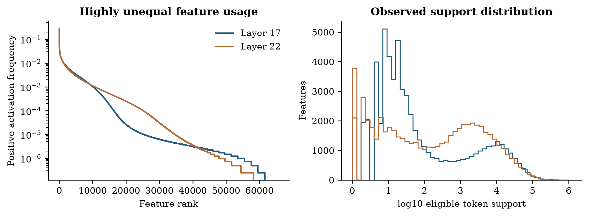
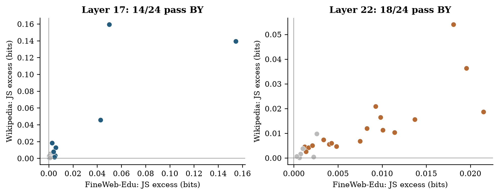
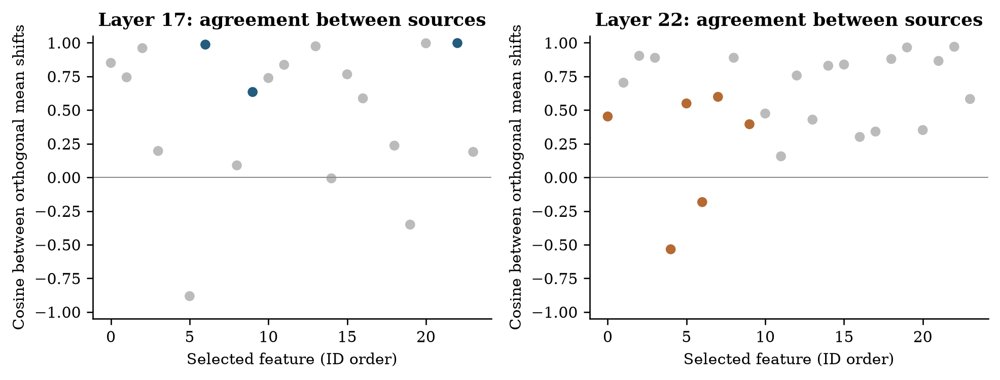
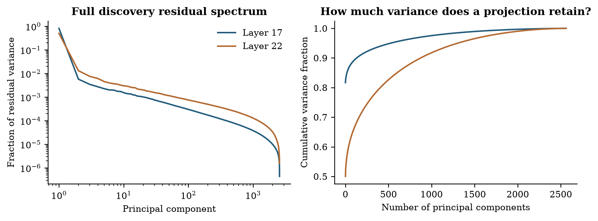
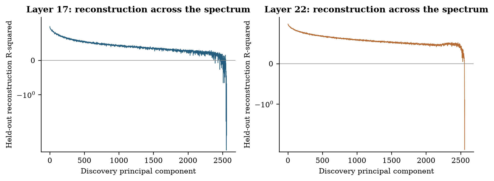
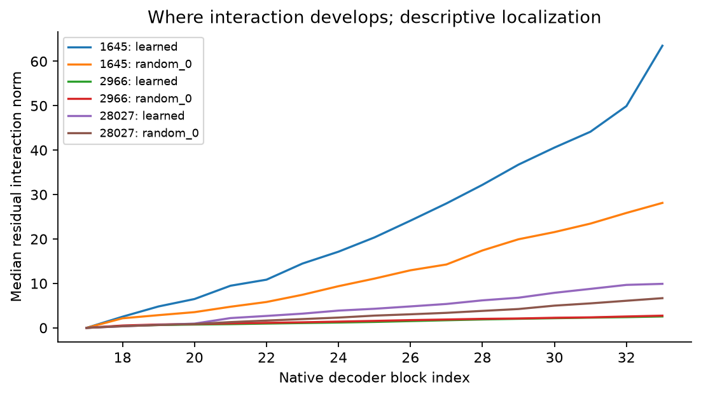

# From activation geometry to context-dependent effects

## A study of SAE pseudo-concepts in Gemma 3 4B

Phase 1 research report | FineWeb-Edu and English Wikipedia | September 2026

## Abstract

A sparse autoencoder gives each dictionary entry a fixed decoder direction, but the model states in which that entry activates can differ substantially. We study whether activation-conditioned context can become an explanation of intervention effects, rather than merely a description of feature usage. The observational foundation covers 12,000 documents, two native residual layers and more than four million eligible token positions per layer. At the primary layer, 14 of 24 selected entries pass a held-out two-source partner-composition test and three pass a separately corrected test of displacement orthogonal to the decoder. A subsequent development pilot evaluates 96 feature-prompt cases with encoder-, decoder-coordinate- and norm-preserving context edits. Raw interaction exceeds random-direction controls for one candidate, but prediction improvement and superiority beyond scalar gain remain uncertain. A new analysis of saved signed responses finds predominantly odd-in-both-signs interactions, compatible with local mixed curvature; it does not establish a transferable learned response or superiority over the leading principal-component control. Together, the results distinguish reproducible contextual organization from a stronger causal explanation that has not yet been demonstrated. The report provides quantitative geometry, controlled intervention evidence and a concrete route toward testing whether feature-specific context predicts selective behavioral effects beyond generic activation geometry.

## 1. Research questions and the central idea

The central question is **whether ordinary activation context contains a transferable explanation of what a fixed SAE intervention does**. An SAE decoder describes the additive reconstruction contribution of a dictionary entry. It does not, by itself, specify how the rest of the transformer will transform that contribution at a particular token. We investigate the relationship between those two descriptions.

We call an SAE entry a **pseudo-concept**: a useful learned unit whose atomicity, semantic purity and uniqueness are not assumed. The same decoder direction can be used in different contexts without rotating, and different dictionary entries can share directions without playing identical roles. Activation magnitude can indicate context without constituting a distinct meaning.

| Research question | Measurement | Current answer |
| --- | --- | --- |
| RQ1. How do decoder directions occupy activation space? | Participation, PCA alignment, reconstruction and cooccurrence | Directions are distributed; directional mass and reconstructed variance tell different stories. |
| RQ2. Does feature strength mark context beyond the decoder axis? | Frozen intensity regimes, conditional partner tests, native orthogonal shifts | Supported for a subset of selected entries, with limited specificity and remaining confounds. |
| RQ3. Does this context predict or selectively change a decoder intervention? | Constrained four-cell edits, prediction checks and gain controls | Raw modulation is present; the stronger predictive and selective claim is not established. |
| RQ4. Is the modulation a coherent local response distinct from generic geometry? | Signed parity, length consistency, transfer and PCA controls | Locally structured responses coexist with uncertain transfer and no clear learned-over-PC advantage. |

Figure 1. The scientific distinction. Amplitude alone moves a contribution along its fixed decoder direction. The contextual hypothesis concerns displacement beyond that direction. These synthetic points illustrate the question and are not experimental observations.

The proposed stronger research contribution is a linked result: a context coordinate learned from unperturbed activations predicts a feature's selective effect on new prompts; changing that coordinate while holding the focal feature fixed changes the predicted effect; and a downstream pathway explains the change. Each link can fail. The present evidence supports contextual organization and supplies a working causal test, but does not complete this chain.

**Reading guide.** Sections 3-10 establish the observational geometry and its statistical limits. Sections 11-12 describe the completed intervention pilot. Section 13 adds exploratory analyses performed entirely on its saved outputs. Sections 14-16 integrate the evidence and define the next research stage. The two older study reports are incorporated here so this document can be read independently.

## 2. Related work and the intended contribution

Superposition motivates studying more representational features than dimensions [1]. Early SAE work and subsequent scaling studies establish useful sparse dictionaries while emphasizing reconstruction and evaluation [2-4]. Gemma Scope and Gemma Scope 2 provide pretrained dictionaries [5,6]. Decoder neighborhoods, cooccurrence and PCA structure are already studied in The Geometry of Concepts [7]; they are foundations for this project rather than priority claims. Noncanonical dictionary structure motivates our use of pseudo-concepts [8].

The most relevant steering work raises the bar further. The cylindrical representation hypothesis investigates context normal to a steering axis [9]. FEGA analyzes context-dependent clouds of logit effects produced by SAE interventions [15]. Pre-intervention side-effect prediction uses feature statistics to forecast steering modularity across features and model settings [16]. Work on multiple mediators relates activation-patching interactions to downstream curvature [17]. Therefore neither context dependence, output-effect geometry, prediction in general nor a nonzero four-cell interaction is a sufficient novelty claim.

Our proposed distinction is **within-feature, transferable explanation from native context to selective effect**, with encoder and decoder coordinates held fixed during the context intervention, explicit generic-geometry controls, and later pathway validation. This is a research target, not an established priority claim. The closest recent studies are preprints, and a final publication claim would require another focused literature review when the evidence is complete.

| Evidence stage | Data and separation | Interpretation |
| --- | --- | --- |
| Observational foundation | Discovery/evaluation documents; frozen mixtures; two-source tests | Conditional associations under stated exchangeability assumptions. |
| Intervention development | Previously collected documents, split into fit/check groups | Controlled effects of artificial edits on diagnostic logits; no fresh confirmation. |
| Signed secondary analysis | Same saved pilot outputs, analyzed after its initial results | Exploratory diagnosis of sign, local scaling and control specificity. |

The check subset of the pilot is not the foundation's untouched evaluation set repurposed as confirmation. All existing corpus observations are development material for the stronger hypothesis. Additional plots and analyses do not increase the number of independent documents.

## 3. Experimental material and observation units

We use the native text backbone of pretrained Gemma 3 4B [10], with Gemma Scope 2 residual-stream SAEs at layers 17 and 22 (the published names and zero-based native block indices). The residual width is 2,560. Each dictionary has 65,536 entries and targets approximately 60 positive activations per token. Layer 17 is primary. Layer 22 tests depth sensitivity in the same model and corpus; it is not an independent model replication. The earlier 1B experiment is a pilot and is not pooled with this study.

The corpus contains 6,000 educational-web documents from the configured FineWeb-Edu sample [11] and 6,000 English Wikipedia articles [12], with at most 512 tokens per document. Sampling uses a seeded finite-buffer streaming shuffle, not a uniform sample of either entire source. Dataset versions and sampled texts were fixed before collection. Every positive SAE activation is retained, without top-k storage truncation. The archive contains 4,858,045 token positions per layer, of which 4,047,982 are eligible for analysis, and 292,102,816 and 303,833,975 positive activation entries at layers 17 and 22 respectively.

Exact normalized duplicates were removed. MinHash retrieval on token windows followed by exact candidate Jaccard comparison found two near-duplicate links. Connected documents share their discovery/evaluation split. Approximate retrieval may miss additional duplicates. Discovery contains 2,965 FineWeb-Edu and 3,054 Wikipedia documents; evaluation contains 3,035 and 2,946. The first token and prespecified token-quality exclusions are omitted from the analysis population.

Figure 2. Corpus and token accounting. Sources have equal document allocation but different document lengths. Colored token bars show eligible positions; gray shows collected positions excluded by analysis rules.

For each feature and source, the primary unit is one confidently assigned token occurrence per detected duplicate group. This avoids counting many occurrences from one document as independent evidence. It does not guarantee independence between distinct documents or remove all topical confounding.

## 4. Methods and mathematical guide

### 4.1 Sparse autoencoders

The residual stream is the running hidden vector passed between transformer blocks and updated by their computations. A token is a model vocabulary piece, which can be a whole word, a subword fragment or a digit. For residual activation x in d dimensions, a nonnegative activation vector a and decoder vectors d_j reconstruct the input as:

Equation 1.

Here b_dec is the decoder bias and L0 counts nonzero entries. The dictionary is overcomplete because its width m exceeds d. Its nonzero decoder vectors cannot all be mutually orthogonal, but overcompleteness alone does not determine which features coactivate. We normalize decoder vectors for directional measurements; their original norms remain relevant to reconstruction amplitude.

These SAEs use JumpReLU: an encoder score below a learned threshold is set to zero, while a sufficiently positive score is retained. The distributional analysis uses positive activations only, so it does not mistake the zero-versus-positive point mass for bimodality.

### 4.2 Support, mixtures and frozen regimes

The supported discovery universe requires at least 500 positive eligible activations in at least 100 documents. A seeded screen of 2,048 features is sampled per layer. On log(1+a), one- and two-component Gaussian mixture fits are compared using the Bayesian information criterion (BIC). A Gaussian mixture is a weighted sum of bell-shaped densities. BIC is minus twice the fitted log likelihood plus the number of fitted parameters times log(sample size); it balances fit against complexity. BIC_one minus BIC_two is positive when the two-component fit is preferred.

Candidates require converged five-start fits, BIC improvement at least 10, component weights at least 0.1 and standardized separation at least 2. Separation is the difference in component means divided by the square root of their average variance, all in log-activation space. At most 24 are selected by discovery BIC improvement. Fits are frozen before evaluation. Evaluation assignment requires posterior probability at least 0.9, and each source needs at least 100 sampled observations in both regimes. Support failures receive p=1 rather than being removed from the correction family.

Two mixture components define operational intensity regions. They can approximate skewness or threshold truncation without a genuinely bimodal density, and do not prove discrete meanings or a sharp transition. A separate descriptive arm randomly selects 64 supported features regardless of mixture qualification and uses discovery-frozen positive-activation quartiles.

### 4.3 Partner composition and conditional permutations

At the sampled weak and strong occurrences, we count positive partner memberships, exclude the focal feature, and retain partners with at least 10 pooled occurrences. This pooled support filter is invariant to label permutation. Normalizing the partner counts gives distributions P and Q. Their Jensen-Shannon divergence, in bits, is:

Equation 2.

JS is zero for identical normalized distributions and at most one bit; the KL terms here use base-two logarithms. It measures relative composition, not absolute activation magnitude. Sparse samples can produce appreciable JS under the null; consequently we report excess over the conditional-null mean as well as raw JS. Separately, Jaccard overlap is intersection size divided by union size, computed for token or document membership sets. Decoder cosine is the dot product divided by the product of vector norms: one means parallel, zero orthogonal, and minus one opposite.

Labels are permuted within each source using strata defined by token identity, position bins of 64 tokens and positive-support bins of 16 features. Every stratum retains its weak/strong counts. Homogeneous strata cannot move; the reported movable fraction exposes this limitation. Source tests use 9,999 permutations and a plus-one p-value:

Equation 3.

The maximum source p-value tests an intersection-union hypothesis: evidence is required in both sources. Benjamini-Yekutieli (BY) correction [13] across all selected features allows arbitrary dependence between valid feature p-values and controls the expected false-discovery proportion. A corrected q-value below 0.05 defines a discovery; it is not the probability that this particular feature's result is false. This does not require identical partner changes across sources. Bootstrap standard errors from 1,000 document resamples yield pointwise normal-approximation intervals for raw JS; these are not simultaneous intervals and do not determine significance.

### 4.4 Principal component analysis (PCA)

PCA finds orthogonal directions ordered by variance [14]. We fit the full covariance on eligible positions every 16 tokens in 300 discovery documents per source:

Equation 4.

The columns of V are principal directions and Lambda contains their variances. PC1 captures the most variation; later PCs capture progressively less. PCA axes have no automatic semantic labels and may reflect nuisance structure. Evaluation data use the frozen discovery mean and basis. Two-dimensional figures disclose explained variance; all inferential geometry uses the full residual space.

### 4.5 Participation and regularized whitening

Squared projection mass describes how a decoder direction occupies a stated coordinate system. Participation ratio and entropy effective dimension summarize its concentration:

Equation 5.

A direction concentrated in one component has effective dimension one; equal mass across K components gives K. We also retain the number of components needed for 90% of mass. Raw coordinates and PCA coordinates can yield different values because locality is basis-dependent. Neither basis is automatically semantically interpretable.

Whitening rescales PCs by inverse standard deviation. It changes the metric and amplifies low-variance estimation noise, so we apply a variance floor:

Equation 6.

The main descriptive floor is 0.001 times the largest eigenvalue, with 0.0001 and 0.01 sensitivity outputs. Directions are normalized after transformation. Whitened participation measures concentration in this rescaled space, not additional semantic dimensions.

### 4.6 Orthogonal context in native activations

The pinned model is replayed at frozen token locations, retaining its original bfloat16 residual values losslessly. The strong-minus-weak mean shift is decomposed into its component along the focal unit decoder and its orthogonal complement:

Equation 7.

The test statistic is the squared norm of the orthogonal shift. It uses 4,999 conditional permutations with the same lexical, position and support strata. Cross-source conjunction and BY correction form a separate secondary family per layer. A large observed orthogonal fraction alone is not evidence: even sampling noise is usually mostly orthogonal in high dimension. Cross-source cosine agreement is descriptive, not an additional independent test.

### 4.7 Reconstruction across the variance spectrum

Decoder alignment is different from reconstruction quality. On 300 separate evaluation reference documents per source, the SAE re-encodes native residuals and we measure:

Equation 8.

The denominator uses evaluation variance about the evaluation mean in the discovery-fitted basis. Negative R-squared means reconstruction error exceeds that PC's variance. The overall centered value is variance-weighted and differs from one minus uncentered relative MSE.

### 4.8 Pooled sensitivity and matched controls

A secondary analysis retains all confident evaluation occurrences and compares labels within document-by-position-by-support strata, with a separate token-identity-stratified sensitivity. This pooled analysis is distinct from the source-specific primary endpoint. Controls are matched without replacement on discovery activation and document support, with an absolute log gap at most 0.35 for each quantity. Strict controls require a converged fit with BIC improvement below 10. The separately prespecified weak-separation arm requires standardized separation below 2 and adds 2,048 seeded discovery fits to its matching pool. Its positive activation tails use the matched candidate's discovery tail fractions; evaluation counts in each regime must exactly match the candidate's.

For supported pairs we report candidate-minus-control raw JS. Displayed pointwise uncertainty uses the estimate plus or minus 1.96 times the sum of the two document-bootstrap standard errors. This bounds the standard error of a difference without assuming independent features, under a normal approximation; it is conservative about covariance but remains approximate. These descriptive comparisons use feature-specific supported partner sets and are not a new corrected discovery family or a test that mixtures cause contextual change.

## 5. Results: support and intensity structure

Figure 3. Unequal dictionary usage. Frequencies use eligible positions. The dictionary accounting retains zero-frequency entries; the log support histogram shows observed entries only.

Figure 4. Discovery distributions for the six layer-17 candidates with largest BIC improvement. Histograms use up to 10,000 seeded discovery occurrences per feature; curves show the frozen weighted Gaussian components in log space. Components are not semantic labels.

## 6. Results: the controlled hypothesis

| Layer | Selected | Both sources supported | Partner BY < .05 | Orthogonal BY < .05 | Pass both families |
| --- | --- | --- | --- | --- | --- |
| 17 | 24 | 19 | 14 | 3 | 3 |
| 22 | 24 | 24 | 18 | 6 | 6 |

At the primary layer, 14 of 24 selected pseudo-concepts passed the two-source partner-composition test and 3 passed the separate orthogonal-geometry test; 3 passed both families. These observations support activation-conditioned contextual organization for a subset of the selected pseudo-concepts. Their native displacement cannot be reduced to scaling the focal decoder vector, conditional on the covariates tested. Passing both separately corrected families is reported as an overlap, not as a separately calibrated combined test.

| Layer-17 feature | Partner q | Orthogonal q | Cross-source shift cosine | Exploratory encoder-control q |
| --- | --- | --- | --- | --- |
| 863 | 0.0033 | 0.0483 | 0.987 | 0.2376 |
| 1645 | 0.0010 | 0.0091 | 0.634 | 0.0060 |
| 28027 | 0.0010 | 0.0091 | 0.998 | 0.0060 |

The distinction between partner changes and native displacement is substantive: 14 selected features pass the partner test, but only three pass the orthogonal test. The latter results identify specific cases, not a dictionary-wide rule. Feature 863 is close to the corrected threshold (q=0.0483); finite Monte Carlo uncertainty makes this case less stable than features 1645 and 28027. Squared orthogonal displacement exceeds its null mean by 14.5% and 16.0% for feature 863, 158.7% and 408.6% for feature 1645, and 7.0% and 8.3% for feature 28027 (FineWeb-Edu and Wikipedia, respectively). Significance in both sources does not necessarily imply the same displacement direction: two of the six layer-22 geometric cases have negative cross-source cosine.

Figure 5. Source-specific JS excess. Points require support in both sources. Colored points pass the partner-conjunction BY criterion; gray points do not. Unsupported features remain in the denominator and correction family.

| Layer | Source | Supported | Median JS excess (bits) | Median movable fraction |
| --- | --- | --- | --- | --- |
| 17 | FineWeb-Edu | 22 | 0.0027 | 6.2% |
| 17 | Wikipedia | 20 | 0.0029 | 8.5% |
| 22 | FineWeb-Edu | 24 | 0.0042 | 13.8% |
| 22 | Wikipedia | 24 | 0.0063 | 9.1% |

Figure 6. Displacement beyond the focal decoder. The horizontal coordinate is the orthogonal fraction of squared mean shift; the vertical coordinate is observed squared displacement divided by its null mean, minus one. A symmetric-log scale retains negative excesses. Colors use the separate geometric conjunction family; this rescaling changes neither statistic nor p-value.

Figure 7. Cross-source directional agreement of orthogonal shifts. Positive cosine indicates broadly similar displacement directions. Significance in both sources does not guarantee directional agreement. Feature indices are separate within each layer.

## 7. Results: coverage of activation space

| Layer | Variance in first 64 PCs | Median raw eff. dim. | Median PCA eff. dim. | Median whitened eff. dim. | Centered reconstruction R-squared |
| --- | --- | --- | --- | --- | --- |
| 17 | 87.9% | 695.3 | 758.2 | 792.8 | 0.937 |
| 22 | 63.1% | 670.6 | 712.2 | 751.1 | 0.867 |

At layer 17, the first 64 PCs contain 87.9% of discovery residual variance, but the median decoder direction places only 4.47% of its squared mass there. At layer 22, the corresponding values are 63.1% and 4.01%. The dictionaries therefore extend broadly outside the dominant variance subspace. Dimension matters: 64 of 2,560 coordinates is only 2.5%, so both median masses exceed the equal-mass reference. Dominant tail mass does not by itself imply a preference for low-variance directions. Nor does it mean that the tail carries most reconstructed energy: frequencies, amplitudes and combinations of directions matter.

Median effective participation spans hundreds of coordinates in both raw and PCA bases. The primary whitening floor changes these medians moderately, while the finer floor has a larger effect at layer 22. Centered held-out reconstruction R-squared is 0.937 at layer 17 and 0.867 at layer 22. Those values are substantially lower than one minus uncentered relative MSE; the residual mean carries energy that should not be mistaken for explained variation.

Figure 8. Full discovery variance spectrum and cumulative explained variance. The complete basis makes the low-variance tail measurable rather than treating unplotted dimensions as absent.

Figure 9. Participation ratios for all 65,536 decoder directions in three coordinate systems. The dashed curve is a separately labelled simulation of 4,096 isotropic Gaussian directions in 2,560 dimensions (seed 20261031); isotropy is defined in the displayed metric. It is a geometric reference, not model data or a hypothesis test. Differences show why narrow or distributed requires an explicit basis and metric.

Figure 10. Decoder mass in the first 64 native PCs. The dashed equal-mass reference is 64 divided by residual dimension. Alignment is not frequency-weighted importance or reconstruction quality.

Figure 11. Decoder similarity and exact token overlap. A seeded 100,000-pair display is drawn from every pair in the 2,048-feature discovery screen. Exact counts for the entire screened universe are retained. This both-split atlas is descriptive; frequency can explain overlap and no interaction is inferred.

| Layer | Feature pair | Decoder cosine | Shared tokens | Token Jaccard | Document Jaccard |
| --- | --- | --- | --- | --- | --- |
| 17 | 408 / 1933 | 0.955 | 585 | 0.009771 | 0.105 |
| 17 | 408 / 984 | 0.947 | 9 | 0.000514 | 0.124 |
| 17 | 408 / 471 | 0.943 | 2 | 0.000023 | 0.101 |
| 22 | 1577 / 1615 | 0.882 | 1176 | 0.024893 | 0.108 |
| 22 | 1577 / 1753 | 0.855 | 382 | 0.019950 | 0.104 |
| 22 | 1156 / 1447 | 0.850 | 7366 | 0.104527 | 0.707 |

The three most parallel screened pairs per layer illustrate why geometry and usage must be measured separately. At layer 17, features 408 and 471 have decoder cosine 0.943 but coactivate at only two eligible token positions. Their document overlap is much larger. Across all screened pairs, Spearman correlation between decoder cosine and token Jaccard is 0.124 at layer 17 and 0.098 at layer 22; correlations with document Jaccard are 0.024 and 0.014. These descriptive associations neither establish feature equivalence nor show that nearby directions perform the same role.

Figure 12. Evaluation reconstruction quality along every discovery PC. The symmetric-log scale retains negative values. Good overall reconstruction can coexist with poor relative reconstruction in weak-variance directions.

## 8. Encoder geometry and contextual examples

An encoder direction w_j computes a feature's score, whereas its decoder vector specifies reconstruction. These directions need not coincide. Under a Gaussian reference, conditioning on a linear encoder score produces mean displacement along covariance times encoder:

Equation 9.

This offers a simple alternative to a richer contextual mechanism. After inspecting the primary and geometric results, we added an explicitly exploratory diagnostic that removes the span of the focal decoder and this discovery-fitted covariance direction, then repeats the conditional full-space test. It uses all selected features, 4,999 permutations, a fixed new seed and a separate BY family. It is not a retroactive prespecified endpoint.

| Layer | Original geometric discoveries | Exploratory diagnostic discoveries | Original cases retained |
| --- | --- | --- | --- |
| 17 | 3 | 6 | 2 |
| 22 | 6 | 11 | 6 |

Two of the three primary-layer geometric cases remain supported after this projection; all six layer-22 cases remain supported. Additional cases can become detectable because removing a high-variance direction can improve a norm-based test's sensitivity. These exploratory outcomes motivate a preregistered follow-up; they do not increase the count of prespecified discoveries or prove that all linear explanations have been removed.

Figure 13. Exploratory covariance-encoder sensitivity. Axes show corrected evidence before and after removing the additional discovery-fitted direction; dashed lines mark q=0.05. Projection changes both signal and null variability, so evidence need not change monotonically.

Figure 14. Signed partner changes for the three primary-layer cases passing both prespecified families. Each panel displays the 20 largest absolute changes among partners supported in both sources. Partner IDs are analytical labels. Color scales are panel-specific; values are absolute conditional-probability differences, not normalized JS weights.

We exported 767 layer-17 and 768 layer-22 seeded context excerpts, with a separate blinded annotation sheet and key. These are preparation for colleague review, not completed semantic validation. Sampled feature-1645 contexts include individual digits in year-like strings in both regimes; this is a reminder that numerical formatting or within-word position can matter even when token identity is controlled. The other illustrated cases include varied words and subword pieces. No single semantic label is assigned from these few excerpts.

## 9. Results: matched controls

| Layer | Selected candidates | Weak controls matched | Evaluation pairs supported |
| --- | --- | --- | --- |
| 17 | 24 | 14 | 4 |
| 22 | 24 | 15 | 4 |

No candidates could be matched to strict low-BIC controls within the prespecified support/document caliper at either layer. The weak-separation arm yields some discovery matches, but many fail the exact evaluation count requirement. Those failures remain visible and are not negative findings. The supported pairs are a small, selected subset of candidates.

All four supported layer-17 candidates have larger raw JS than their matched controls, with differences of 0.053 to 0.459 bits. At layer 22, two differences are positive and two negative, ranging from -0.011 to 0.032 bits. All eight supported controls have p=0.0001 under both pooled conditional nulls. Thus the comparisons show substantial layer-17 candidate effects in this selected subset, while also showing that contextual change is present in controls. They do not establish a general advantage of mixture-selected features across depth or specificity of the phenomenon to such features.

Figure 15. Pooled candidate-control comparisons at identical weak/strong token counts. Positive differences mean larger raw JS for the candidate. Bars are conservative, approximate pointwise intervals based on marginal document-bootstrap errors; they are not simultaneous or source-conjunction intervals. Supported controls can themselves exhibit conditional contextual change, so these comparisons do not establish specificity to mixture-selected features.

## 10. Complementary geometric checks and transition to intervention

As a descriptive consistency check, we sum decoder vectors weighted by the strong-minus-weak change in binary partner probability, then compare this vector with the actual native mean shift. This sum omits partner activation magnitudes, so it is not an SAE reconstruction of the mean difference. Agreement shows that membership changes can track part of the native contextual displacement; disagreement can reflect amplitudes, omitted rare partners or reconstruction error. These measurements share observations and cannot serve as independent confirmation.

We also compare the focal decoder's 20 nearest directions among all dictionary entries with its 20 most probable supported partners in each regime. This differs from the earlier screened-pair atlas: the direction search here covers all 65,536 entries for each selected focal feature, while the coactivation neighborhood uses the declared supported partner universe.

The next stage asks whether these observational directions can explain changes in the effect of a fixed decoder edit. The geometry motivates the intervention; it does not predetermine its outcome.

## 11. From observational context to a controlled intervention

### 11.1 Candidate preparation and observation units

The observational study motivates asking whether a context direction has functional consequences. We selected primary-layer entries 1645 and 28027 as candidate cases, included weak-control entry 7087, and added entry 2966 as a background comparison before examining intervention outputs. Entry 2966 is not a matched causal control for the two candidates. A minimum of 20 within-stratum observations was required to estimate a context contrast; entry 7087 had only 17 and was not run. Its failure remains in the accounting.

| Pseudo-concept | Within-stratum observations | Fraction of contrast retained by constraint projection | Pilot status |
| --- | ---: | ---: | --- |
| 1645 | 1,418 | 0.387 | 32 feature-prompt cases |
| 28027 | 133 | 0.967 | 32 feature-prompt cases |
| 7087 | 17 | Not estimated | Insufficient overlap |
| 2966 | 53 | 0.973 | 32 feature-prompt cases; background comparison |

For each supported entry and source, eight fit and eight check documents were selected. In total, there are 96 feature-prompt cases from 95 distinct duplicate groups. A seeded group split prevents the same duplicate group from entering both fit and check across features. The comparison is intentionally small: each feature has only 16 check groups, and a source-specific check has eight. Many interventions on the same prefix improve within-prefix comparison, not sample size.

The learned direction is a fit-only high-minus-low mean contrast between positive-activation quartiles. Contrasts are calculated within source, token identity, position-bin and positive-support-bin strata, with overlap weights proportional to n_low times n_high divided by their sum. This focuses the estimate on strata containing both regimes. Its projection removes both the focal encoder direction and the unit decoder direction. No intervention outcomes are used to select this direction.

### 11.2 Preserving the focal feature while editing context

Let h be the native residual vector, u the unit decoder direction, w the encoder vector and Q the orthogonal projector onto the complement of their span. Holding only u's coordinate fixed does not hold the feature score fixed, because the encoder need not equal the decoder. We therefore edit in the intersection of the two constraints. A rotation within that subspace also preserves the total residual norm:

Equation 10.

Here r is Qh, v is the unit tangent component of the learned context direction after removing r, and beta is the desired chord length. The rotation sign reverses its tangent component. At finite length, the two edits are not exact negatives: both include the same small inward radial component. Degenerate directions fail explicitly. The construction preserves the encoder score, decoder coordinate and input norm in real arithmetic, and all three are checked again on representable float32 states.

The feature score's JumpReLU threshold is unchanged. One selected case is inactive under the float32 encoder despite being positive in the original bfloat16 collection; it is retained transparently. The study does not replace native hidden states with SAE reconstructions.

### 11.3 Four-cell design and output readouts

For each baseline prefix we evaluate the unedited state, decoder-only edit, context-only edit and their combined edit. The context displacement is calculated once at the baseline and reused exactly in both context-containing cells. All four arms recompute the identical full prefix without a key/value cache. The factorial interaction subtracts both individual effects:

Equation 11.

Y is a two-dimensional vector of output logit contrasts. A logit is the model's score before conversion into a probability. The first contrast compares the mean scores of digit tokens 0-9 with comma, period and semicolon. The second compares common word-start tokens (' the', ' and', ' of') with suffix tokens ('ing', 'tion', 'ly'). The token sets were resolved to single vocabulary IDs before inference. Scores are measured before any optional logit soft-capping.

These are formatting diagnostics motivated by observed contexts, not validated measures of numerical reasoning, syntax or semantic intent. Averaging token logits is a contrast of scores, not a difference of total probability masses. Both contrasts use their original units; an unweighted Euclidean norm gives them equal numerical weight, not equal scientific importance.

The two decoder doses are plus/minus 0.1 times the fit median positive activation multiplied by the decoder norm. The resulting absolute native doses are about 85.59 for entry 1645, 8.92 for 28027 and 12.97 for 2966. Context chord lengths are 0.5% and 1% of the baseline residual norm, in both signs. Thus raw magnitudes cannot be ranked across features as intrinsic importance: their native doses differ.

Seven context directions are evaluated: learned, three seeded random directions, leading activation PC, a spectrum-matched direction, and a shuffled-regime contrast. All undergo the same focal-coordinate and norm constraints. Spectrum matching is approximate because reprojecting its randomized PC coefficients changes their spectrum. These controls test different alternatives; beating shuffled labels is weaker evidence of feature specificity than beating a strong generic activation direction.

The design yields 56 factorial comparisons and 87 full-prefix forward passes per feature-prompt case: 5,376 comparisons and 8,352 forward passes overall. Reused cells are deliberate and retained in the dependence structure. Inference uses float32 with TF32 disabled, while the observational archive used bfloat16. Maximum audited relative constraint/additivity error is 1.40 times 10^-6, below the specified tolerance of 10^-5. This checks implementation fidelity, not whether the perturbed state is natural.

### 11.4 What counts as more than scalar gain?

Define e0 as the decoder's two-contrast effect at baseline and e1 as its effect after the context edit. A context edit can change their magnitude while retaining the same effect direction. We remove the best scalar multiple of e0 and measure the remaining component:

Equation 12.

This is a least-squares projection in the two chosen contrast coordinates. A small residual means the change can be described mainly as scaling, including a negative scale; it does not show there is no other behavioral change outside the two readouts. Cases with squared baseline effect at most 10^-8 are omitted only from this unstable projection, while their raw interactions remain. A large residual still requires comparison with generic controls.

### 11.5 Normalization and other generic nonlinearities

Preserving the norm of h does not remove normalization interactions downstream. Even a simple normalized linear readout can have a nonzero factorial interaction. If Y(h) equals a dot h divided by R(h), and R is root mean square with a numerical stabilizer, the same constraints imply:

Equation 13.

The decoder-containing pair has a common denominator R_alpha, while the decoder-free pair has R_0. Their difference can multiply the context numerator. This surrogate is a diagnostic, not a complete transformer model and not a valid subtraction that removes all normalization effects. Similarly, a large intermediate residual interaction norm locates accumulation but does not identify an attention head, MLP or causal pathway.

### 11.6 Prediction and uncertainty

The original prediction target is e0: the decoder effect before a context intervention. Ridge regression uses fit-only preprocessing and a fixed regularization coefficient of one. It penalizes large coefficients while predicting the two output contrasts:

Equation 14.

The nuisance model includes encoder score, residual norm, position, log positive support, token identity, source and trailing digit/Latin-letter counts. Alternatives add the learned context score, or both that score and eight reference PCs; a scalar-gain alternative constrains output to the training-mean effect direction. The PCs are from the original foundation reference, not a new confirmation sample. Pooled calibration is evaluated on check groups; single-source calibration is evaluated on the other source's check groups.

The intercept is fitted without a penalty. Mean squared error (MSE) is the average squared discrepancy across the two contrasts. Positive nuisance-minus-context MSE indicates improvement. Uncertainty resamples duplicate groups, weights groups equally and keeps the fitted predictor fixed. The 95% percentile intervals use 2,000 seeded resamples, omit calibration-fit uncertainty and are not multiplicity-corrected. They are descriptive diagnostics, unlike the foundation's corrected conditional tests.

## 12. Intervention results: what the pilot supports

### 12.1 Raw interaction is stronger evidence than selective function

| Entry | Learned minus random | Mean | 95% descriptive interval |
| --- | --- | --- | --- |
| 1645 | Raw interaction | 0.002742 | [0.001054, 0.00518] |
| 1645 | Beyond gain | 0.001354 | [-7.159e-05, 0.003081] |
| 2966 | Raw interaction | -4.658e-05 | [-0.0001135, 1.976e-05] |
| 2966 | Beyond gain | -1.334e-06 | [-7.507e-05, 7.389e-05] |
| 28027 | Raw interaction | 0.0005361 | [-1.825e-06, 0.00107] |
| 28027 | Beyond gain | 0.0004899 | [-4.717e-05, 0.001101] |

Entry 1645 shows a positive learned-minus-mean-random raw interaction interval on check groups. Its beyond-gain interval includes zero. Neither of the other two entries has a beyond-gain interval entirely above zero. The raw result for 28027 lies very close to an interval boundary; it should not be treated as a robust binary distinction. These estimates describe selected cases and two formatting readouts, not the prevalence of causal context effects in the dictionary.

Figure 16. Paired learned-minus-mean-random effects on development-check groups. Each point averages repeated signs and lengths within groups; intervals are descriptive. The beyond-gain endpoint removes the best scalar multiple of the baseline two-contrast effect.

The full direction comparison shows why a random baseline alone is insufficient. Leading-PC interventions can have effects comparable to the learned direction. Independent-looking error bars in the next figure are not a paired superiority test; the explicit paired comparisons appear in Section 13.

Figure 17. Interaction norms for all seven context directions, pooled over development cases and doses. Features have different native decoder doses. Separate intervals should not be read as paired tests; this is a descriptive view of the control hierarchy.

### 12.2 Propagation and prediction quality

Actual interactions are not exhausted by the illustrated normalization-only surrogate. That fact does not distinguish a feature-specific mechanism from other generic nonlinearities. Layerwise interaction norms accumulate downstream for learned and random edits; they cannot reveal a signed response pathway because only norms were retained at these layers.

Figure 18. Actual interaction norm against the normalization-only surrogate for learned context edits. The surrogate isolates one possible source of interaction; it is not a complete normalization correction.

Figure 19. Layerwise residual interaction norms for the learned direction and one seeded random example. These curves show propagation, with the intervention applied at block 17. They do not establish which component mediates an output effect.

Adding the learned context coordinate does not produce a pooled prediction-improvement interval entirely above zero for any of the three supported entries. The weaker conclusion is uncertainty, not proof that context is useless: fit and check each contain only 16 groups per feature and the chosen response variables may be poor measures of its function. Nevertheless, this pilot does not supply the predictive link required by the central hypothesis.

| Entry | Pooled MSE improvement | 95% descriptive interval |
| --- | --- | --- |
| 1645 | -4.826e-06 | [-2.339e-05, 1.746e-05] |
| 2966 | -6.223e-09 | [-2.82e-08, 1.474e-08] |
| 28027 | 2.588e-07 | [-4.096e-06, 4.91e-06] |

Figure 20. Prediction error on check groups after pooled fit-only calibration. Lower MSE is better. Context and PC models add different information to the nuisance baseline, while the gain model restricts the predicted output direction.

We also retain the change in negative log probability of the observed next token, measured in nats. Positive change means that the edit made the actual continuation less likely. This is a local quality check, not a complete generation evaluation. One prefix reaches the collection boundary and has no observed next token; its loss is missing while its valid interaction measurements remain.

Figure 21. Interaction norm versus combined-edit change in next-token loss. This checks whether a visible diagnostic effect accompanies worse local prediction. It neither measures long-form generation quality nor validates the two contrasts as semantic endpoints.

## 13. New exploratory analysis using saved responses

The initial report summarized interaction magnitudes. Taking a norm discards sign, so large average magnitudes can coexist with cancellation across prompts. The saved four-cell outputs allow us to examine this limitation without another model run. This analysis was planned after viewing the initial norm and prediction results; it is explicitly post-result exploration. It neither changes the original endpoints nor converts the check split into fresh confirmation.

### 13.1 Separate sign-consistent interaction from even components

At a fixed context length, let I_st be the signed interaction for decoder sign s and context-rotation sign t, each plus/minus one. Its four parity components are:

Equation 15.

The component C_11 is odd in both signs. A locally bilinear response has this symmetry: reversing either intervention reverses the interaction. The remaining components capture even contributions at these finite steps, including the shared inward radial term of the spherical context edit and higher-order response terms. Orthogonality of the four sign patterns gives an exact decomposition of the average squared interaction norm. The odd-odd energy fraction is not a semantic score.

| Entry | Mean odd-odd energy fraction | Median fraction | Median relative length discrepancy |
| --- | --- | --- | --- |
| 1645 | 0.9001 | 0.9534 | 0.04995 |
| 2966 | 0.967 | 0.9892 | 0.02731 |
| 28027 | 0.9694 | 0.9931 | 0.01791 |

For the learned direction, mean odd-odd energy fractions on check groups are about 90.0%, 96.7% and 96.9% for entries 1645, 2966 and 28027. Thus the unsigned effects are largely associated with a signed local interaction rather than being dominated by even-in-sign terms. The same property occurs for control directions. It is compatible with generic mixed curvature and does not establish a feature-specific mechanism.

Figure 22. Fraction of squared interaction energy in the component odd in decoder sign and context sign. Each dot is one check group's average across the two lengths; black marks show means. All directions are retained, including random and generic geometry controls.

### 13.2 Local scaling at the two available context lengths

To compare the two lengths, we divide C_11 by the absolute fractional decoder dose a and context fraction b, defining K. This is a response coefficient in the experiment's fractional intervention coordinates. We also retain coefficients divided by actual native alpha and chord length in the numerical tables. The finite-difference relation and the bounded discrepancy are:

Equation 16.

For a differentiable readout and infinitesimal tangent edits, native-unit scaling approaches a mixed Hessian action along the decoder and context tangent. We have only one absolute decoder-dose magnitude and two finite context lengths, so these data cannot establish derivative convergence or rule out higher odd terms. K also remains feature-specific in its dose calibration: multiplying by fitted feature scale and baseline norm changes its units from native curvature.

Median relative discrepancies between the small- and large-length coefficients are 5.0% for 1645, 2.7% for 2966 and 1.8% for 28027. The largest discrepancy is 18.3% for 1645. These numbers suggest reasonably stable local scaling over the tested context-length range, while leaving decoder-dose convergence open. Ratios become unstable for vanishing responses; the raw signed coordinates are therefore shown alongside the summary.

Figure 23. Signed response coefficients at context chords of 0.5% and 1% of residual norm. Circles show the digit contrast and triangles the word contrast. The diagonal represents equal coefficients after fractional-dose normalization. Each point is a check case, not an independent new experiment.

### 13.3 Do signed responses transfer from fit to check?

A stable mean signed response is a deliberately simple transfer target. For each feature and intervention direction, we average K over the two lengths within each group, estimate its mean on fit groups, and predict that vector on check groups. We compare its error with a zero-response baseline:

Equation 17.

Positive improvement means that the fit mean predicts the signed response better than zero. This is a different, exploratory target from the original regression of e0 on context: a successful constant mean would establish neither prompt-specific context prediction nor selective function. Calibration uncertainty is again omitted, and results for every direction and both cross-source calibrations are retained in the tables.

Figure 24. Signed learned-direction response coefficients, averaged across lengths, with both output contrasts displayed separately. Color distinguishes source; crosses denote fit groups and circles check groups. Dispersion and sign changes explain why interaction magnitude alone cannot demonstrate transfer.

| Entry | MSE improvement | 95% descriptive interval | Leave-one-out minimum | Leave-one-out maximum |
| --- | --- | --- | --- | --- |
| 1645 | -2.567 | [-21.95, 10.46] | -4.729 | 5.439 |
| 2966 | -0.001554 | [-0.01868, 0.0159] | -0.005935 | 0.001431 |
| 28027 | 0.3699 | [-0.6512, 1.392] | 0.07743 | 0.6508 |

The learned direction has no pooled transfer-improvement interval entirely above zero. Entry 28027 has a positive mean, but its interval spans zero; source-to-source learned transfer is also uncertain for all three entries. For 1645, removing one check group can change the pooled point estimate from negative to positive, exposing substantial influence at this sample size. Its large unsigned interaction is therefore not a reliable shared signed response in this pilot.

Figure 25. Fit-mean signed-response prediction compared with zero on check groups. Positive values favor transfer of a constant signed response. All seven directions are shown; intervals are uncorrected and conditional on the fitted mean. This is distinct from the original context-score prediction task.

The leading-PC direction for 28027 has a positive descriptive transfer interval, approximately 0.20 to 2.03 in squared coefficient units. This is one of many exploratory comparisons, not a corrected discovery. Its relevance is the alternative explanation it raises: a generic high-variance direction may organize responses at least as well as the feature-derived context direction. It does not establish PC superiority: the direction-specific response targets differ, and a common-target prediction comparison is needed.

### 13.4 Specificity depends on the control

The new paired analysis compares learned-minus-control norms on the same check groups, keeping signs, doses and lengths matched. For 1645 and 28027, beyond-gain differences favor learned over the approximate spectrum and shuffled-label controls in descriptive intervals. Yet all learned-minus-leading-PC beyond-gain intervals include zero, as do the learned-minus-mean-random beyond-gain intervals. Thus the analysis supports sensitivity to control choice, not a general selective advantage of the learned direction.

| Entry | Learned minus PC | Mean | 95% descriptive interval |
| --- | --- | --- | --- |
| 1645 | Raw interaction | 0.0005293 | [-0.001448, 0.002445] |
| 1645 | Beyond gain | 0.001662 | [-0.0005226, 0.004759] |
| 2966 | Raw interaction | -0.0001325 | [-0.0002273, -4.953e-05] |
| 2966 | Beyond gain | -9.958e-05 | [-0.000245, 2.119e-05] |
| 28027 | Raw interaction | -0.0003137 | [-0.0009815, 0.0003756] |
| 28027 | Beyond gain | 2.262e-05 | [-0.0005832, 0.0006187] |

Figure 26. Paired learned-minus-control comparisons, separately for raw interaction and the component beyond scalar gain. Intervals resample the same check groups with equal group weights. Positive values favor learned. Leading-PC controls expose a more demanding alternative than shuffled labels alone.

These results narrow the next question. The immediate target is not to find another large interaction, but to determine whether a feature-derived context coordinate explains a reproducible selective effect after accounting for generic high-variance context. The existing signed outputs materially improve this diagnosis without adding inference cost, while also showing why the current strongest claim must remain open.

### 13.5 Does the learned score add information beyond PCs?

A final CPU-only diagnostic addresses the common-target prediction question directly. The original eight-PC predictor already includes the learned context score. We add the missing nuisance-plus-PC-only model, retain the same preprocessing and fixed ridge penalty, and measure PC-only MSE minus PC-plus-context MSE on the same check decoder effects. This comparison changes the predictor while keeping its target fixed. It was added after the earlier exploratory results and remains a development analysis.

| Entry | Calibration to check | MSE improvement | 95% descriptive interval |
| --- | --- | --- | --- |
| 1645 | Web to Wiki | 9.341e-06 | [-5.591e-05, 5.197e-05] |
| 1645 | Pooled | -4.009e-05 | [-7.058e-05, -1.09e-05] |
| 1645 | Wiki to Web | 8.281e-07 | [-1.733e-05, 2.507e-05] |
| 2966 | Web to Wiki | 7.445e-08 | [-3.524e-07, 5.273e-07] |
| 2966 | Pooled | -2.417e-08 | [-5.132e-08, 1.403e-09] |
| 2966 | Wiki to Web | -1.652e-07 | [-3.455e-07, -1.288e-08] |
| 28027 | Web to Wiki | -2.518e-06 | [-8.72e-06, 4.33e-06] |
| 28027 | Pooled | -1.977e-06 | [-7.705e-06, 3.472e-06] |
| 28027 | Wiki to Web | 1.739e-05 | [4.047e-06, 3.67e-05] |

Figure 27. Incremental prediction improvement from adding the learned context score to the nuisance-plus-eight-PC model. Every supported feature and calibration source is shown. Positive means reduced MSE on the same decoder-effect target. Cross-source intervals use eight check groups and pooled intervals use sixteen; all are descriptive and uncorrected.

No feature has a positive pooled interval. Adding context worsens pooled prediction for 1645, with mean improvement -4.01 times 10^-5 and an interval entirely below zero under this fixed-fit bootstrap. The Wikipedia-to-web comparison for 28027 is positive, about 1.74 times 10^-5 with interval [4.05 times 10^-6, 3.67 times 10^-5], but does not replicate in the reverse direction or pooled analysis.

The apparent cross-source gain also illustrates why the baseline matters. In that 28027 comparison, PC-only MSE is approximately 0.000348 and PC-plus-context MSE 0.000330, whereas nuisance-only MSE is 0.000189 and nuisance-plus-context MSE 0.000182. The richer models remain worse than the simpler alternatives: an improvement over an underperforming PC model is not evidence of a successful selective predictor. Small calibration sets and fixed regularization are plausible limitations. The analysis reproduces every original prediction error exactly while isolating the previously missing increment.

This completes the immediately useful Phase 1 checks: the existing archive supports precise diagnosis of local modulation, control dependence and failed or unstable prediction. A stronger result now requires a better validated behavioral target and independent evidence, rather than further selection among these same comparisons.

## 14. Integrated interpretation

### 14.1 What the evidence establishes

The foundation gives a quantitative account of how an overcomplete SAE dictionary occupies residual space. Decoder participation spans hundreds of dimensions, alignment with high-variance PCs differs from reconstruction quality, and decoder proximity need not imply token-level coactivation. These are useful empirical results even before making a causal interpretation.

Controlled observational comparisons identify a subset of selected pseudo-concepts whose weak and strong occurrences differ in partner composition and native geometry beyond the focal decoder. The subsequent intervention pilot demonstrates that associated constrained context edits can modulate diagnostic decoder effects. The signed analysis shows mostly local odd-odd response structure at the tested lengths. These statements concern different estimands and should not be collapsed into one proof.

### 14.2 What remains unsupported

Neither mixture separation nor a large orthogonal displacement establishes distinct semantic identities. The background and matched controls show that contextual variation is not exclusive to strongly separated activation distributions. A large factorial interaction does not establish a novel mechanism, and preserving the feature score does not preserve every other property of the state. Current prediction and gain-control results do not establish the central stronger hypothesis.

The most coherent reading is that **activation-conditioned geometry is reproducible in selected cases, while its conversion into a specific, transferable explanation of intervention effects remains unresolved**. The leading-PC comparisons make generic activation geometry a concrete competing explanation. This is a scientifically useful boundary: it identifies the missing link instead of rewarding increasingly elaborate descriptions of the same data.

| Claim | Evidence available | Appropriate wording |
| --- | --- | --- |
| Dictionary directions broadly cover coordinates and PCs | Full dictionary participation and evaluation reconstruction | Descriptive geometry, with explicit metric and population. |
| Selected intensity regimes differ in context | Two-source conditional partner and orthogonal tests | Conditional association for selected entries. |
| Context edits modulate a decoder intervention | Native four-cell responses with numerical audits | Controlled interaction in diagnostic outputs. |
| Learned context uniquely predicts selective function | Prediction, gain and PC comparisons are inconclusive | Not established by the present pilot. |
| A particular downstream mechanism explains modulation | No pathway ablation/rescue | Open research question. |

## 15. Phase 2: a focused continuation

### 15.1 Improve the behavioral question before increasing scale

The next stage should validate what a candidate actually affects. The exported blinded context sheets can support independent annotation of weak and strong examples, with disagreement recorded rather than resolved by looking at outcomes. For entry 1645, numerical-string position and year formatting are concrete nuisance alternatives; entry 28027 includes word and subword fragments. These observations motivate candidate endpoints but do not determine their semantic labels.

Use a small development set to specify at least two interpretable, jointly meaningful output contrasts or continuation-level scores. Calibrate a minimum useful effect and a quality budget before choosing the confirmation sample size. Keep diagnostics on unrelated continuations so apparent selectivity is not simply general disruption. Larger models can be an external-validity step, but more parameters alone will not solve an ambiguous endpoint or a weak control.

### 15.2 Test feature-specific context against generic geometry

Freeze a predictor using feature-derived context and compare it with nuisance, scalar-gain and an appropriately regularized PC-context model. The next decisive endpoint is incremental prediction of selective effect on new documents, not the existence of an interaction. Match perturbation constraints and native step sizes, calibrate regularization without using confirmation outcomes, and compare prediction errors on paired prompts.

A complementary candidate is a shared response subspace learned on development data and evaluated on new prompts with a fixed projection. It is useful only if it predicts beyond the generic-PC and gain alternatives. A low-rank construction is not evidence that the model's full function is intrinsically low-dimensional, and a positive post-result fit must be labeled exploratory until tested independently.

### 15.3 Establish a mechanism with targeted inference

If a candidate passes the behavioral and predictive gate, run a small predeclared pathway experiment: block the proposed mediator, measure attenuation of the predicted interaction, and attempt a matched rescue. Include a neighboring or unrelated pathway control. Norm trajectories can guide where to inspect, but cannot replace these interventions. Save signed intermediate vectors or the necessary projections; the present archive's layer norms cannot recover them.

Use additional smaller absolute decoder doses to test local convergence and distinguish a persistent response from a finite-step artifact. The present two context lengths already inform a useful range, but cannot answer the decoder-dose question. These focused passes are far cheaper than repeating the entire positive-activation collection and should precede a larger confirmation run.

### 15.4 Freeze confirmation and replicate the analytical unit

Once the endpoint and control hierarchy are defensible, freeze the hypothesis, effect threshold, exclusions, multiplicity family and stopping rule. Estimate sample size from document-level variation with allowance for calibration uncertainty and source heterogeneity. Collect fresh deduplicated prompts; do not reuse this report's check cases as confirmation. Require replication across sources and an independent SAE dictionary, width or training seed before treating an individual entry as a stable unit of explanation. A larger model is a subsequent scope test rather than a substitute for these checks.

| Stage | Can use current saved results? | Decision before moving on |
| --- | --- | --- |
| Geometry, sign and generic-control diagnosis | Yes; completed here | Identify the specific unresolved contrast. |
| Blind review and endpoint specification | Existing excerpts can start this | Establish a meaningful behavioral target. |
| Decoder-dose and pathway pilot | Requires limited additional inference | Validate local behavior and a plausible mediator. |
| Fresh predictive and selective confirmation | Requires new prompts and inference | Beat gain and generic-geometry baselines by a useful amount. |
| SAE/model replication | Requires another dictionary or model | Assess robustness of the analytical unit and scope. |

## 16. Limitations and reproducibility

The observational study uses two English sources, a finite streaming sample, one model and two dependent layers. Duplicate detection is approximate. Conditional exchangeability is assumed within stated strata; lexical, position and sparsity controls do not eliminate topic, syntax or every encoder-related explanation. Candidate selection favors separated intensity fits and cannot estimate dictionary-wide prevalence. Strict matched controls were unavailable and supported weak-control pairs were few.

PCA describes covariance rather than semantics. Low-variance directions are sensitive to finite-sample estimation; whitening changes the metric and can amplify noise. Participation depends on coordinates. Good centered reconstruction does not show that every behaviorally important direction is reconstructed, and directional mass does not measure causal importance.

The intervention study has only three supported entries, two formatting contrasts and 16 check groups per entry. Its fit/check separation does not make the older corpus a fresh confirmation source. Artificial edits can leave the natural data manifold despite preserving three focal quantities. Float32 inference differs from the bfloat16 observational collection. An inactive case and a missing continuation target are retained with their respective limitations. Fixed-fit bootstrap intervals understate uncertainty if interpreted as including the entire training procedure; no such interpretation is intended.

The new signed analysis is post-result exploration across multiple directions and endpoints. A largely odd-odd response is consistent with generic local curvature. Two finite context lengths and a single absolute decoder-dose magnitude do not establish an infinitesimal derivative. The two-dimensional output metric limits what gain, energy and transfer mean. No completed blinded semantic validation, pathway ablation/rescue, fresh confirmation or independent-SAE replication is available.

Figures and tables are regenerated from retained artifacts. The new analyses use saved outputs without model execution. Protocols, exact versions and execution records are maintained separately. This Phase 1 report supports research discussion and a focused continuation; unresolved claims remain questions.

## References

[1] Elhage et al. (2022). [Toy Models of Superposition](https://transformer-circuits.pub/2022/toy_model/index.html).

[2] Bricken et al. (2023). [Towards Monosemanticity](https://www.transformer-circuits.pub/2023/monosemantic-features/index.html).

[3] Cunningham et al. (2023). [Sparse Autoencoders Find Highly Interpretable Features in Language Models](https://arxiv.org/abs/2309.08600).

[4] Gao et al. (2024). [Scaling and evaluating sparse autoencoders](https://arxiv.org/abs/2406.04093).

[5] Lieberum et al. (2024). [Gemma Scope](https://arxiv.org/abs/2408.05147).

[6] McDougall et al. (2025). [Gemma Scope 2](https://deepmind.google/blog/gemma-scope-2-helping-the-ai-safety-community-deepen-understanding-of-complex-language-model-behavior/).

[7] Li et al. (2024). [The Geometry of Concepts: Sparse Autoencoder Feature Structure](https://arxiv.org/abs/2410.19750).

[8] Leask et al. (2025). [Sparse Autoencoders Do Not Find Canonical Units of Analysis](https://arxiv.org/abs/2502.04878).

[9] Gao et al. (2026). [The Cylindrical Representation Hypothesis for Language Model Steering](https://arxiv.org/abs/2605.01844).

[10] Gemma Team (2025). [Gemma 3 Technical Report](https://arxiv.org/abs/2503.19786).

[11] Penedo et al. (2024). [The FineWeb Datasets](https://arxiv.org/abs/2406.17557); [FineWeb-Edu](https://huggingface.co/datasets/HuggingFaceFW/fineweb-edu).

[12] Wikimedia Foundation. [English Wikipedia dataset](https://huggingface.co/datasets/wikimedia/wikipedia), 2023-11-01 English snapshot.

[13] Benjamini and Yekutieli (2001). [The control of the false discovery rate in multiple testing under dependency](https://doi.org/10.1214/aos/1013699998). Annals of Statistics 29, 1165-1188.

[14] Jolliffe and Cadima (2016). [Principal component analysis: a review and recent developments](https://pubmed.ncbi.nlm.nih.gov/26953178/). Philosophical Transactions A 374, 20150202.

[15] Hoang et al. (2026). [Sparse Autoencoders Encode Both Concepts and Functions: The Downstream Geometry of Feature Effects](https://arxiv.org/abs/2607.24645).

[16] Duan (2026). [Pre-Intervention Prediction of Sparse Autoencoder Steering Side Effects](https://arxiv.org/abs/2606.08365).

[17] Vaidyanathan et al. (2026). [The Curse of Multiple Mediators: Hidden Interaction Effects in Activation Patching](https://arxiv.org/abs/2606.27510).
